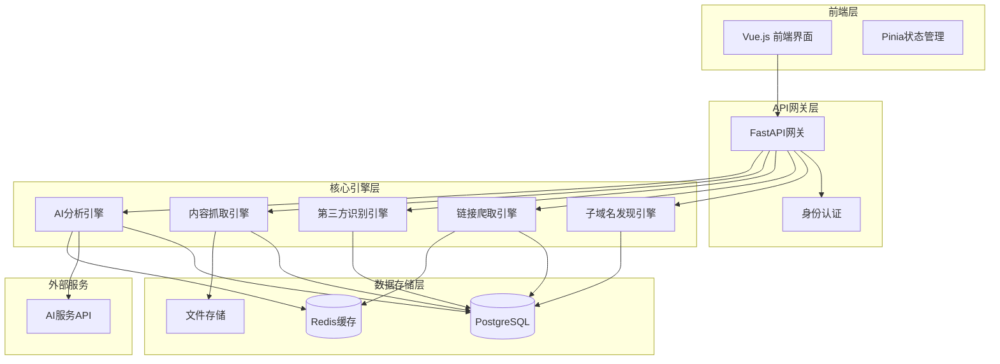
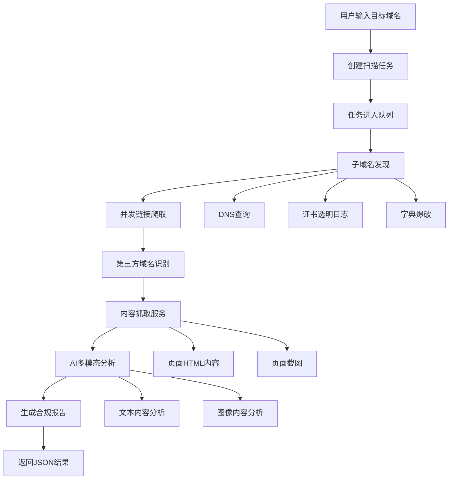

# 域名合规扫描系统设计文档

## 概述

域名合规扫描系统是一个基于AI的智能合规检测平台，能够自动化识别和评估第三方域名的内容安全风险。系统通过输入目标域名，自动发现子域名、爬取链接、识别第三方域名，并利用AI技术对页面内容和截图进行智能分析，最终输出标准化的合规检测报告。

### 技术栈

**前端**: Vue.js 3.x + TypeScript + Element Plus + Pinia + Vue Router + Vite
**后端**: FastAPI + SQLAlchemy + Celery + Redis + PostgreSQL + Playwright
**AI服务**: 用户自定义OpenAI API + 多AI提供商支持
**认证授权**: JWT Token + 基于角色的访问控制(RBAC)
**数据隔离**: 基于用户的多租户数据隔离

## 系统架构

### 整体架构图



### 核心业务流程



## 前端架构

### 组件设计

```typescript
// 核心组件结构
interface ComponentStructure {
  pages: {
    LoginPage: "登录页面";
    DashboardPage: "仪表板页面";
    ScanPage: "扫描页面";
    TaskPage: "任务管理页面";
    TaskDetailPage: "任务详情页面";
    ReportPage: "报告页面";
    UserManagePage: "用户管理页面";
    SystemConfigPage: "系统配置页面";
    ProfilePage: "个人设置页面";
  };
  business: {
    LoginForm: "登录表单";
    ScanForm: "扫描表单";
    TaskList: "任务列表";
    TaskMonitor: "任务监控";
    ReportViewer: "报告查看器";
    UserManager: "用户管理";
    ConfigManager: "配置管理";
    AIConfigForm: "AI配置表单";
  };
}
```

### 状态管理

```typescript
// stores/auth.ts
interface User {
  id: string;
  username: string;
  email: string;
  role: 'admin' | 'user';
  ai_config?: AIConfig;
}

interface AuthStore {
  user: User | null;
  token: string | null;
  isAuthenticated: boolean;
  permissions: string[];
}

// stores/scan.ts
interface ScanTask {
  id: string;
  user_id: string;
  target_domain: string;
  status: 'pending' | 'running' | 'completed' | 'failed';
  progress: number;
  created_at: string;
  config: ScanConfig;
  logs: TaskLog[];
  statistics: TaskStatistics;
}

// stores/config.ts
interface SystemConfig {
  scan_limits: {
    max_concurrent_tasks: number;
    max_subdomains: number;
  };
  ai_settings: {
    default_model: string;
    timeout: number;
  };
}
```

## 后端架构

### API接口设计

```python
# main.py
from fastapi import FastAPI
from api.v1 import tasks, reports

app = FastAPI(title="域名合规扫描系统API", version="1.0.0")
app.include_router(tasks.router, prefix="/api/v1/tasks")
app.include_router(reports.router, prefix="/api/v1/reports")

# 用户认证API
@router.post("/auth/login", response_model=LoginResponse)
async def login(credentials: LoginRequest):
    """用户登录"""

@router.post("/auth/register", response_model=UserResponse)
async def register(user_data: RegisterRequest):
    """用户注册"""

# 任务管理API
@router.post("/tasks", response_model=TaskResponse)
async def create_scan_task(
    task_request: ScanTaskRequest,
    current_user: User = Depends(get_current_user)
):
    """创建域名扫描任务"""

@router.get("/tasks/{task_id}/logs", response_model=List[TaskLogResponse])
async def get_task_logs(
    task_id: str,
    current_user: User = Depends(get_current_user)
):
    """获取任务日志"""

# 用户配置API
@router.put("/users/ai-config", response_model=AIConfigResponse)
async def update_ai_config(
    ai_config: AIConfigRequest,
    current_user: User = Depends(get_current_user)
):
    """更新AI配置"""

# 系统管理API (仅管理员)
@router.put("/admin/system-config", response_model=SystemConfigResponse)
async def update_system_config(
    config: SystemConfigRequest,
    current_user: User = Depends(get_admin_user)
):
    """更新系统配置"""
```

### 数据模型设计

```python
# models/user.py
class User(SQLAlchemyBase):
    __tablename__ = "users"
    
    id = Column(String, primary_key=True, default=generate_uuid)
    username = Column(String(100), unique=True, nullable=False)
    email = Column(String(255), unique=True, nullable=False)
    password_hash = Column(String(255), nullable=False)
    role = Column(Enum(UserRole), default=UserRole.USER)
    is_active = Column(Boolean, default=True)
    created_at = Column(DateTime, default=datetime.utcnow)
    
    scan_tasks = relationship("ScanTask", back_populates="user")
    ai_config = relationship("UserAIConfig", back_populates="user")

class UserAIConfig(SQLAlchemyBase):
    __tablename__ = "user_ai_configs"
    
    id = Column(String, primary_key=True, default=generate_uuid)
    user_id = Column(String, ForeignKey("users.id"), unique=True)
    openai_api_key = Column(String(255))  # 加密存储
    openai_model = Column(String(100), default="gpt-4-vision-preview")
    max_tokens = Column(Integer, default=1000)
    temperature = Column(Float, default=0.7)
    
    user = relationship("User", back_populates="ai_config")

# models/task.py  
class ScanTask(SQLAlchemyBase):
    __tablename__ = "scan_tasks"
    
    id = Column(String, primary_key=True, default=generate_uuid)
    user_id = Column(String, ForeignKey("users.id"), nullable=False)  # 数据隔离
    target_domain = Column(String(255), nullable=False)
    status = Column(Enum(TaskStatus), default=TaskStatus.PENDING)
    progress = Column(Integer, default=0)
    config = Column(JSON)
    created_at = Column(DateTime, default=datetime.utcnow)
    
    # 统计信息
    total_subdomains = Column(Integer, default=0)
    total_pages_crawled = Column(Integer, default=0)
    total_violations = Column(Integer, default=0)
    
    user = relationship("User", back_populates="scan_tasks")
    task_logs = relationship("TaskLog", back_populates="task")

class TaskLog(SQLAlchemyBase):
    __tablename__ = "task_logs"
    
    id = Column(String, primary_key=True, default=generate_uuid)
    task_id = Column(String, ForeignKey("scan_tasks.id"))
    level = Column(String(20))  # INFO, WARNING, ERROR
    message = Column(Text)
    module = Column(String(100))  # subdomain_discovery, crawler, ai_analysis
    created_at = Column(DateTime, default=datetime.utcnow)
    
    task = relationship("ScanTask", back_populates="task_logs")

class ThirdPartyDomain(SQLAlchemyBase):
    __tablename__ = "third_party_domains"
    
    id = Column(String, primary_key=True, default=generate_uuid)
    task_id = Column(String, ForeignKey("scan_tasks.id"))
    domain = Column(String(255), nullable=False)
    found_on_url = Column(String(2048))
    domain_type = Column(String(50))  # 'cdn', 'analytics', 'ads', 'social'
    risk_level = Column(Enum(RiskLevel), default=RiskLevel.UNKNOWN)
    screenshot_path = Column(String(500))
    is_analyzed = Column(Boolean, default=False)

class ViolationRecord(SQLAlchemyBase):
    __tablename__ = "violation_records"
    
    id = Column(String, primary_key=True, default=generate_uuid)
    task_id = Column(String, ForeignKey("scan_tasks.id"))
    domain = Column(String(255), nullable=False)
    violation_type = Column(String(100))
    confidence_score = Column(Float)
    content_snippet = Column(Text)
    ai_analysis_result = Column(JSON)
    detected_at = Column(DateTime, default=datetime.utcnow)
```

## 权限控制系统

### 基于角色的访问控制(RBAC)

```python
# models/permission.py
class Role(SQLAlchemyBase):
    __tablename__ = "roles"
    
    id = Column(String, primary_key=True, default=generate_uuid)
    name = Column(String(50), unique=True, nullable=False)
    description = Column(String(255))
    
    permissions = relationship("Permission", secondary="role_permissions")

class Permission(SQLAlchemyBase):
    __tablename__ = "permissions"
    
    id = Column(String, primary_key=True, default=generate_uuid)
    name = Column(String(100), unique=True, nullable=False)
    resource = Column(String(50))  # task, user, system
    action = Column(String(50))    # create, read, update, delete

# 权限装饰器
def require_permission(resource: str, action: str):
    def decorator(func):
        @wraps(func)
        async def wrapper(*args, **kwargs):
            current_user = kwargs.get('current_user')
            if not has_permission(current_user, resource, action):
                raise HTTPException(status_code=403, detail="权限不足")
            return await func(*args, **kwargs)
        return wrapper
    return decorator
```

## 任务监控系统

### 实时任务监控

```python
# services/task_monitor.py
class TaskMonitorService:
    def __init__(self):
        self.websocket_manager = WebSocketManager()
    
    async def track_task_progress(self, task_id: str, progress: int, message: str):
        """跟踪任务进度"""
        await self.update_task_progress(task_id, progress)
        await self.log_task_event(task_id, "INFO", message)
        
        # 实时推送到前端
        await self.websocket_manager.broadcast_to_user(
            task_id, 
            {"type": "progress_update", "progress": progress, "message": message}
        )
```

### WebSocket实时通信

```python
# websocket/manager.py
class WebSocketManager:
    def __init__(self):
        self.active_connections: Dict[str, List[WebSocket]] = {}
    
    async def connect(self, websocket: WebSocket, user_id: str):
        await websocket.accept()
        if user_id not in self.active_connections:
            self.active_connections[user_id] = []
        self.active_connections[user_id].append(websocket)
    
    async def broadcast_to_user(self, user_id: str, message: dict):
        if user_id in self.active_connections:
            for connection in self.active_connections[user_id]:
                try:
                    await connection.send_json(message)
                except:
                    await self.disconnect(connection, user_id)
```

## 系统配置管理

### 配置管理服务

```python
# services/config_service.py
class ConfigService:
    def __init__(self):
        self.cache = redis.Redis()
    
    async def get_system_config(self, key: str) -> Any:
        """获取系统配置"""
        cached_value = await self.cache.get(f"config:{key}")
        if cached_value:
            return json.loads(cached_value)
        
        config = await self.db.query(SystemConfig).filter_by(config_key=key).first()
        if config:
            await self.cache.setex(f"config:{key}", 3600, json.dumps(config.config_value))
            return config.config_value
        return None
    
    async def update_system_config(self, key: str, value: Any, user_id: str):
        """更新系统配置"""
        config = SystemConfig(
            config_key=key,
            config_value=value,
            updated_by=user_id
        )
        await self.db.save(config)
        await self.cache.setex(f"config:{key}", 3600, json.dumps(value))
```

### 配置项定义

```python
# config/system_defaults.py
SYSTEM_CONFIG_DEFAULTS = {
    "scan_limits": {
        "max_concurrent_tasks_per_user": 5,
        "max_subdomains_per_task": 1000,
        "max_crawl_depth": 5,
        "task_timeout_hours": 24
    },
    "ai_settings": {
        "default_model": "gpt-4-vision-preview",
        "max_tokens": 1000,
        "temperature": 0.7,
        "timeout_seconds": 120,
        "retry_count": 3
    },
    "security": {
        "session_timeout_minutes": 480,
        "max_login_attempts": 5,
        "lockout_duration_minutes": 30
    }
}
```

## AI分析引擎增强

### 用户自定义AI配置

```python
# engines/ai_analysis.py
class AIAnalysisEngine:
    def __init__(self, user_ai_config: UserAIConfig):
        self.client = OpenAI(
            api_key=user_ai_config.openai_api_key,
            base_url=user_ai_config.openai_base_url
        )
        self.config = user_ai_config
    
    async def analyze_content(self, domain: str, content: str, screenshot_path: str) -> AnalysisResult:
        """使用用户自定义配置分析内容"""
        prompt = self._build_analysis_prompt(domain, content)
        image_data = self._encode_image(screenshot_path)
        
        response = await self.client.chat.completions.acreate(
            model=self.config.openai_model,
            messages=[{
                "role": "user",
                "content": [
                    {"type": "text", "text": prompt},
                    {"type": "image_url", "image_url": {"url": f"data:image/png;base64,{image_data}"}}
                ]
            }],
            max_tokens=self.config.max_tokens,
            temperature=self.config.temperature
        )
        
        return self._parse_ai_response(response.choices[0].message.content)
```

## 系统配置

### 扫描任务配置

```python
# config/scan_config.py
@dataclass
class ScanTaskConfig:
    # 用户权限配置
    user_id: str
    max_tasks_per_user: int = 5
    
    # 子域名发现配置
    subdomain_discovery: bool = True
    max_subdomains: int = 1000
    discovery_timeout: int = 300
    
    # 链接爬取配置
    crawl_depth: int = 3
    max_pages_per_domain: int = 100
    crawl_timeout: int = 600
    respect_robots_txt: bool = True
    
    # AI分析配置
    ai_analysis_enabled: bool = True
    use_user_ai_config: bool = True  # 使用用户自定义AI配置
    confidence_threshold: float = 0.7
    
    # 监控配置
    enable_real_time_monitoring: bool = True
    log_level: str = "INFO"
    
    # 并发控制
    max_concurrent_subdomains: int = 10
    max_concurrent_crawlers: int = 5
    max_concurrent_ai_requests: int = 2
        )
        
        return self._parse_ai_response(response.choices[0].message.content)
```

## 核心功能模块

### 子域名发现引擎

```python
# engines/subdomain_discovery.py
class SubdomainDiscoveryEngine:
    def __init__(self, config: DiscoveryConfig, task_monitor: TaskMonitorService):
        self.config = config
        self.task_monitor = task_monitor
        self.methods = [
            DNSQueryMethod(),
            CertificateTransparencyMethod(),
            BruteForceMethod()
        ]
    
    async def discover(self, domain: str, task_id: str) -> List[SubdomainResult]:
        """并发执行多种发现方法"""
        await self.task_monitor.track_task_progress(task_id, 10, f"开始子域名发现: {domain}")
        
        tasks = [method.discover(domain) for method in self.methods]
        results = await asyncio.gather(*tasks)
        
        merged_results = self._merge_and_validate(results)
        await self.task_monitor.track_task_progress(task_id, 30, f"发现 {len(merged_results)} 个子域名")
        
        return merged_results
```

### 第三方域名识别引擎

```python
# engines/third_party_identifier.py
class ThirdPartyIdentifier:
    def __init__(self, task_monitor: TaskMonitorService):
        self.task_monitor = task_monitor
        self.known_cdns = self._load_cdn_patterns()
        self.known_analytics = self._load_analytics_patterns()
        self.known_ads = self._load_ads_patterns()
    
    async def identify_third_party_domains(self, target_domain: str, all_links: List[str], task_id: str) -> List[ThirdPartyDomain]:
        """识别第三方域名"""
        await self.task_monitor.track_task_progress(task_id, 60, "开始识别第三方域名")
        
        third_party_domains = []
        
        for link in all_links:
            domain = self._extract_domain(link)
            
            if self._is_subdomain_of(domain, target_domain):
                continue
            
            domain_type = self._classify_domain_type(domain)
            risk_level = self._assess_risk_level(domain, domain_type)
            
            third_party_domains.append(ThirdPartyDomain(
                domain=domain,
                found_on_url=link,
                domain_type=domain_type,
                risk_level=risk_level
            ))
        
        await self.task_monitor.track_task_progress(task_id, 70, f"识别到 {len(third_party_domains)} 个第三方域名")
        return third_party_domains
```
```

### AI分析引擎

```python
# engines/ai_analysis.py
class AIAnalysisEngine:
    def __init__(self, config: AIConfig):
        self.client = OpenAI(api_key=config.api_key)
    
    async def analyze_content(self, domain: str, content: str, screenshot_path: str) -> AnalysisResult:
        """分析页面内容和截图"""
        prompt = self._build_analysis_prompt(domain, content)
        image_data = self._encode_image(screenshot_path)
        
        response = await self.client.chat.completions.acreate(
            model="gpt-4-vision-preview",
            messages=[{
                "role": "user",
                "content": [
                    {"type": "text", "text": prompt},
                    {"type": "image_url", "image_url": {"url": f"data:image/png;base64,{image_data}"}}
                ]
            }],
            max_tokens=1000
        )
        
        return self._parse_ai_response(response.choices[0].message.content)
```

## 系统配置

### 扫描任务配置

```python
@dataclass
class ScanTaskConfig:
    # 子域名发现配置
    subdomain_discovery: bool = True
    max_subdomains: int = 1000
    discovery_timeout: int = 300
    
    # 链接爬取配置
    crawl_depth: int = 3
    max_pages_per_domain: int = 100
    crawl_timeout: int = 600
    
    # AI分析配置
    ai_analysis_enabled: bool = True
    ai_provider: str = "openai"
    confidence_threshold: float = 0.7
    
    # 并发控制
    max_concurrent_subdomains: int = 10
    max_concurrent_crawlers: int = 5
    max_concurrent_ai_requests: int = 2
```

### AI提示词模板

```python
AI_ANALYSIS_PROMPT = """
作为专业内容安全审核员，请分析以下网站：

域名：{domain}
内容摘要：{content_summary}

检测违规类型：
1. 色情内容
2. 赌博内容  
3. 诈骗内容
4. 恶意软件
5. 仇恨言论

请以JSON格式返回：
{{
    "is_violation": boolean,
    "violation_types": ["类型列表"],
    "confidence_score": 0.0-1.0,
    "risk_level": "low|medium|high",
    "reasoning": "详细分析理由"
}}
"""
```

## 输出JSON格式规范

```json
{
  "scan_task": {
    "id": "task_uuid",
    "target_domain": "example.com",
    "status": "completed",
    "started_at": "2024-01-15T10:00:00Z",
    "completed_at": "2024-01-15T10:30:00Z"
  },
  "discovery_summary": {
    "total_subdomains": 25,
    "total_pages_crawled": 150,
    "total_third_party_domains": 12,
    "total_violations_found": 3
  },
  "third_party_domains": [
    {
      "domain": "suspicious-ads.com",
      "domain_type": "ads",
      "risk_level": "high",
      "found_on_urls": ["https://example.com/page1"],
      "screenshot_path": "/storage/screenshots/suspicious-ads.com.png"
    }
  ],
  "violations": [
    {
      "domain": "suspicious-ads.com",
      "violation_types": ["色情内容", "诈骗内容"],
      "confidence_score": 0.92,
      "risk_level": "high",
      "evidence": ["页面包含不当图片", "检测到诈骗关键词"],
      "ai_analysis": {
        "model": "gpt-4-vision",
        "reasoning": "页面包含明显的违规内容",
        "analyzed_at": "2024-01-15T10:25:00Z"
      },
      "screenshot_path": "/storage/screenshots/suspicious-ads.com.png"
    }
  ],
  "compliance_summary": {
    "overall_risk_level": "medium",
    "total_violations": 3,
    "compliance_score": 75,
    "recommendations": [
      "建议屏蔽高风险域名",
      "建议定期重新扫描"
    ]
  }
}
```

## 性能优化

### 并发控制策略
- 子域名发现：并发数限制为10
- 链接爬取：并发数限制为5  
- AI分析：并发数限制为2，避免API限制
- 使用Redis缓存重复内容分析结果

### 资源管理
- 设置任务超时机制
- 实现任务优先级队列
- 异步处理所有IO操作
- 合理配置数据库连接池

## 安全考量

### 访问控制
- API密钥管理和轮换
- 请求频率限制
- IP白名单机制

### 数据保护  
- 敏感数据加密存储
- 定期清理过期截图和日志
- 遵循robots.txt协议
- 实现数据备份和恢复机制