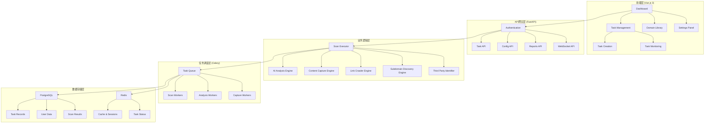
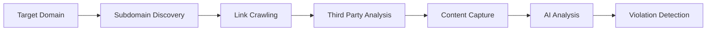
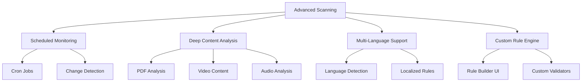
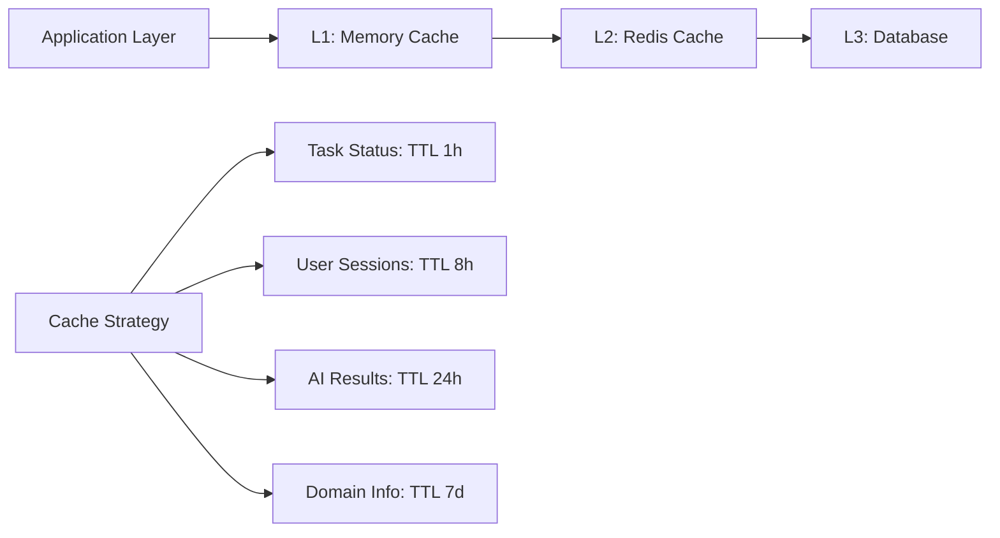
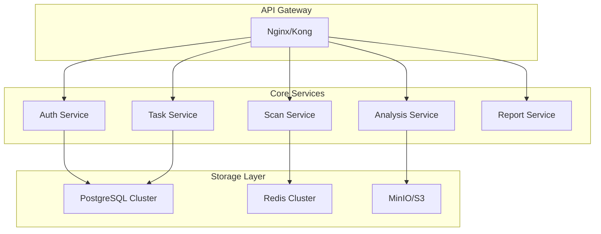

# AI内容安全监控系统 - 项目分析与优化规划

## 1. 项目现状分析

### 1.1 技术架构概览



### 1.2 核心模块分析

#### 后端模块结构
- **API层**: 7个主要路由模块 (auth, tasks, config, reports, admin, websocket, domains)
- **核心引擎**: 5个专业扫描引擎
- **数据模型**: 完整的用户、任务、结果数据模型
- **任务系统**: Celery异步任务处理
- **实时通信**: WebSocket监控系统

#### 前端模块结构
- **UI框架**: Vue 3 + TypeScript + Element Plus
- **状态管理**: Pinia状态管理
- **路由系统**: Vue Router配置
- **图表组件**: ECharts可视化
- **API集成**: Axios HTTP客户端

### 1.3 技术栈评估

#### 优势技术选型
✅ **FastAPI**: 现代Python Web框架，自动API文档，类型提示支持  
✅ **Vue 3 + TypeScript**: 响应式前端框架，类型安全  
✅ **PostgreSQL + Redis**: 可靠的关系型数据库 + 高性能缓存  
✅ **Celery**: 成熟的分布式任务队列  
✅ **Playwright**: 现代浏览器自动化工具  

#### 依赖分析
- **生产依赖**: 27个核心包，版本相对较新
- **开发依赖**: 包含完整的测试、格式化工具链
- **安全性**: 使用了加密库、认证库等安全组件

## 2. 代码质量评估

### 2.1 架构设计质量

#### 优秀设计模式
- **分层架构**: API → 业务逻辑 → 数据访问层清晰分离
- **异步处理**: 合理使用async/await处理I/O密集任务  
- **依赖注入**: FastAPI的依赖注入系统使用得当
- **事件驱动**: WebSocket实现实时监控功能

#### 需要改进的设计
- **单一职责原则**: 部分引擎类功能过于集中
- **配置管理**: 硬编码配置较多，缺少环境隔离
- **错误处理**: 异常处理不够统一和完善

### 2.2 代码实现质量

#### 良好实践
- **类型提示**: 后端广泛使用类型注解
- **文档字符串**: 关键类和方法有较好的文档
- **日志系统**: 结构化日志记录
- **数据验证**: Pydantic模型验证

#### 待优化问题
- **数据库查询**: 存在N+1查询问题潜在风险
- **内存管理**: 大文件处理时内存占用较高
- **并发控制**: 缺少细粒度的并发控制机制
- **缓存策略**: Redis缓存使用不够充分

### 2.3 测试覆盖率

#### 现有测试
- **API测试**: 基础的API端点测试
- **集成测试**: 部分业务流程测试
- **性能测试**: 简单的性能基准测试

#### 测试缺口
- **单元测试**: 引擎模块单元测试不足
- **前端测试**: 缺少Vue组件测试
- **端到端测试**: 缺少完整的E2E测试

## 3. 功能分析与拓展规划

### 3.1 现有核心功能

#### 扫描引擎功能


- **子域名发现**: 多种发现策略 (DNS查询、证书透明度、搜索引擎)
- **链接爬取**: 迭代式网页爬取，支持JavaScript渲染
- **第三方识别**: 识别CDN、广告、分析等第三方服务
- **内容抓取**: Playwright截图和内容提取
- **AI分析**: GPT-4 Vision多模态内容分析

#### 监控与管理功能
- **实时监控**: WebSocket任务进度推送
- **任务管理**: 创建、停止、重试、删除任务
- **结果分析**: 违规统计、风险评估、报告生成
- **用户系统**: 认证、权限、配置管理

### 3.2 功能拓展方向

#### 3.2.1 高级扫描功能


#### 3.2.2 AI能力增强
- **多模型支持**: 集成Claude、Gemini等其他AI模型
- **本地AI模型**: 支持私有化部署的AI模型
- **智能分类**: 自动内容分类和标签
- **趋势预测**: 基于历史数据的风险趋势分析

#### 3.2.3 企业级功能
- **多租户支持**: 企业级多组织架构
- **API集成**: RESTful API for 第三方系统集成
- **数据导出**: 支持多种格式的数据导出
- **合规报告**: 符合各种法规要求的报告模板

## 4. 性能优化策略

### 4.1 数据库性能优化

#### 索引优化策略
```sql
-- 现有索引分析
CREATE INDEX idx_scan_tasks_user_status ON scan_tasks(user_id, status);
CREATE INDEX idx_scan_tasks_created_at ON scan_tasks(created_at DESC);
CREATE INDEX idx_violation_records_task_risk ON violation_records(task_id, risk_level);

-- 建议新增索引
CREATE INDEX idx_subdomain_records_task_accessible ON subdomain_records(task_id, is_accessible);
CREATE INDEX idx_third_party_domains_risk_type ON third_party_domains(risk_level, domain_type);
CREATE INDEX idx_task_logs_task_level_created ON task_logs(task_id, level, created_at DESC);
```

#### 查询优化
- **分页优化**: 使用cursor-based pagination替代offset
- **关联查询**: 优化N+1查询问题
- **数据分区**: 大表按时间分区存储
- **读写分离**: 主从数据库架构

### 4.2 缓存优化策略

#### Redis缓存层设计


#### 缓存策略
- **任务状态缓存**: 实时任务状态信息
- **结果缓存**: AI分析结果缓存减少重复计算
- **配置缓存**: 用户配置信息缓存
- **统计数据缓存**: Dashboard统计数据缓存

### 4.3 并发性能优化

#### 异步处理优化
```python
# 现有任务执行模式
async def execute_scan_sequential():
    subdomains = await discover_subdomains()
    links = await crawl_links()
    content = await capture_content()
    analysis = await ai_analysis()

# 优化后并发执行模式  
async def execute_scan_concurrent():
    # 并行执行独立任务
    tasks = [
        discover_subdomains(),
        crawl_initial_links(), 
        identify_third_parties()
    ]
    results = await asyncio.gather(*tasks)
    
    # Pipeline式处理
    async for page_batch in crawl_pages_stream():
        await process_batch_concurrent(page_batch)
```

#### 资源池优化
- **数据库连接池**: 动态调整连接池大小
- **浏览器实例池**: 复用Playwright浏览器实例
- **HTTP客户端池**: 复用aiohttp会话
- **AI API限流**: 智能请求频率控制

## 5. 系统优化重构

### 5.1 架构层面优化

#### 5.1.1 微服务化改造


#### 5.1.2 配置管理优化
```yaml
# config/environments/production.yaml
app:
  name: "AI Content Security"
  version: "2.0.0"
  debug: false

database:
  primary:
    url: "${DATABASE_PRIMARY_URL}"
    pool_size: 20
    max_overflow: 30
  replica:
    url: "${DATABASE_REPLICA_URL}" 
    pool_size: 10

cache:
  redis:
    cluster_urls: ["${REDIS_NODE_1}", "${REDIS_NODE_2}", "${REDIS_NODE_3}"]
    password: "${REDIS_PASSWORD}"
    
ai_models:
  openai:
    api_key: "${OPENAI_API_KEY}"
    rate_limit: 100
  anthropic:
    api_key: "${ANTHROPIC_API_KEY}"
    rate_limit: 50
```

### 5.2 代码质量提升

#### 5.2.1 依赖注入重构
```python
# 优化前：硬编码依赖
class ScanTaskExecutor:
    def __init__(self, task_id: str, user_id: str):
        self.subdomain_engine = SubdomainDiscoveryEngine(task_id, user_id)
        self.crawler_engine = LinkCrawlerEngine(task_id, user_id)
        # ...

# 优化后：依赖注入
@dataclass
class ScanEngines:
    subdomain_engine: SubdomainDiscoveryEngine
    crawler_engine: LinkCrawlerEngine
    identifier_engine: ThirdPartyIdentifierEngine
    capture_engine: ContentCaptureEngine
    ai_engine: AIAnalysisEngine

class ScanTaskExecutor:
    def __init__(self, task_id: str, user_id: str, engines: ScanEngines):
        self.task_id = task_id
        self.user_id = user_id
        self.engines = engines
```

#### 5.2.2 错误处理标准化
```python
# 统一异常处理系统
class DomainScanException(Exception):
    def __init__(self, message: str, error_code: str, context: dict = None):
        self.message = message
        self.error_code = error_code  
        self.context = context or {}
        super().__init__(message)

class SubdomainDiscoveryError(DomainScanException):
    pass

class AIAnalysisError(DomainScanException):  
    pass

# 全局异常处理器
@app.exception_handler(DomainScanException)
async def domain_scan_exception_handler(request: Request, exc: DomainScanException):
    return JSONResponse(
        status_code=400,
        content={
            "error_code": exc.error_code,
            "message": exc.message,
            "context": exc.context,
            "request_id": request.state.request_id
        }
    )
```

### 5.3 前端优化重构

#### 5.3.1 组件化架构优化
```typescript
// 优化前：单一大组件
// TaskList.vue - 394行代码

// 优化后：组件拆分
// TaskList.vue -> TaskListContainer.vue
//              -> TaskListHeader.vue  
//              -> TaskListFilters.vue
//              -> TaskListTable.vue
//              -> TaskListPagination.vue

// 可复用组件设计
interface BaseTableProps<T> {
  data: T[]
  loading: boolean
  columns: TableColumn<T>[]
  pagination?: PaginationConfig
}

const BaseTable = defineComponent<BaseTableProps>({
  // 通用表格组件实现
})
```

#### 5.3.2 状态管理优化
```typescript
// 优化 Pinia Store 结构
export const useTaskStore = defineStore('tasks', () => {
  // State
  const tasks = ref<Task[]>([])
  const currentTask = ref<Task | null>(null)
  const filters = ref<TaskFilters>({})
  const pagination = ref<PaginationState>({
    page: 1,
    pageSize: 20, 
    total: 0
  })
  
  // Actions  
  const fetchTasks = async (params?: TaskQueryParams) => {
    // 实现数据获取逻辑
  }
  
  const createTask = async (taskData: CreateTaskRequest) => {
    // 实现任务创建逻辑
  }
  
  // Getters
  const runningTasks = computed(() => 
    tasks.value.filter(task => task.status === 'running')
  )
  
  return {
    // State
    tasks: readonly(tasks),
    currentTask: readonly(currentTask),
    filters,
    pagination,
    
    // Actions
    fetchTasks,
    createTask,
    
    // Getters  
    runningTasks
  }
})
```

## 6. 部署运维优化

### 6.1 容器化部署优化

#### Docker优化配置
```dockerfile
# 多阶段构建优化
FROM node:18-alpine AS frontend-builder
WORKDIR /app/frontend
COPY frontend/package*.json ./
RUN npm ci --only=production && npm cache clean --force
COPY frontend/ ./
RUN npm run build

FROM python:3.11-slim AS backend-builder  
WORKDIR /app
COPY requirements.txt .
RUN pip install --no-cache-dir --user -r requirements.txt

FROM python:3.11-slim AS runtime
RUN apt-get update && apt-get install -y \
    postgresql-client \
    && rm -rf /var/lib/apt/lists/*
    
WORKDIR /app
COPY --from=backend-builder /root/.local /root/.local
COPY --from=frontend-builder /app/frontend/dist ./frontend/dist
COPY . .

ENV PATH=/root/.local/bin:$PATH
EXPOSE 8000
CMD ["uvicorn", "main:app", "--host", "0.0.0.0", "--port", "8000"]
```

#### Kubernetes部署清单
```yaml
apiVersion: apps/v1
kind: Deployment
metadata:
  name: ai-content-security
spec:
  replicas: 3
  selector:
    matchLabels:
      app: ai-content-security
  template:
    metadata:
      labels:
        app: ai-content-security
    spec:
      containers:
      - name: app
        image: ai-content-security:latest
        ports:
        - containerPort: 8000
        env:
        - name: DATABASE_URL
          valueFrom:
            secretKeyRef:
              name: db-secret
              key: url
        resources:
          requests:
            memory: "512Mi"
            cpu: "200m"
          limits:
            memory: "1Gi"  
            cpu: "500m"
```

### 6.2 监控告警系统

#### 监控指标配置
```python
# Prometheus监控指标扩展
from prometheus_client import Counter, Histogram, Gauge

# 业务指标
SCAN_TASKS_CREATED = Counter('scan_tasks_created_total', 'Total scan tasks created', ['user_id'])
SCAN_DURATION = Histogram('scan_duration_seconds', 'Scan execution duration', ['domain'])
AI_API_CALLS = Counter('ai_api_calls_total', 'AI API calls', ['model', 'status'])
VIOLATION_DETECTED = Counter('violations_detected_total', 'Violations detected', ['type', 'severity'])

# 系统指标  
ACTIVE_CONNECTIONS = Gauge('websocket_connections_active', 'Active WebSocket connections')
QUEUE_SIZE = Gauge('celery_queue_size', 'Celery queue size', ['queue'])
```

#### 告警规则配置
```yaml
# Prometheus告警规则
groups:
- name: ai-content-security
  rules:
  - alert: HighErrorRate
    expr: rate(http_requests_total{status=~"5.."}[5m]) > 0.1
    for: 2m
    labels:
      severity: warning
    annotations:
      summary: "High error rate detected"
      
  - alert: TaskQueueBacklog  
    expr: celery_queue_size > 100
    for: 5m
    labels:
      severity: critical
    annotations:
      summary: "Task queue backlog is growing"
      
  - alert: AIAPIFailure
    expr: rate(ai_api_calls_total{status="error"}[10m]) > 0.2  
    for: 3m
    labels:
      severity: warning
    annotations:
      summary: "AI API failure rate is high"
```