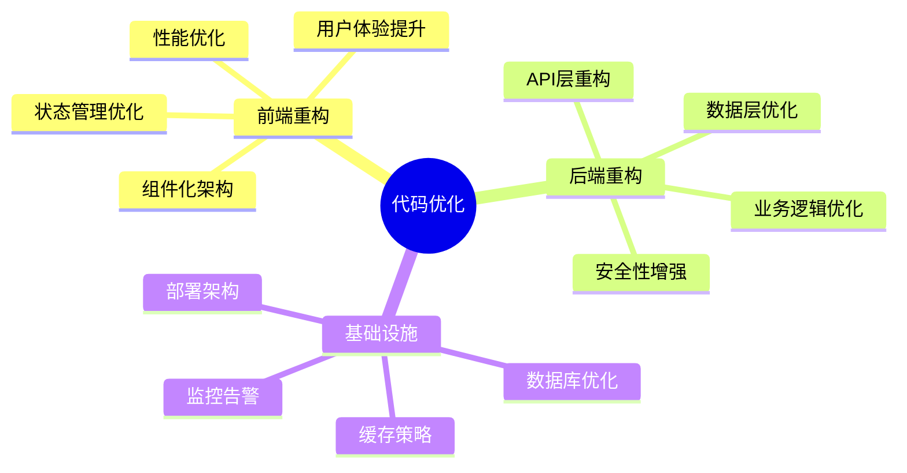
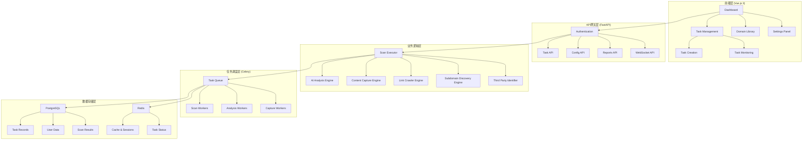
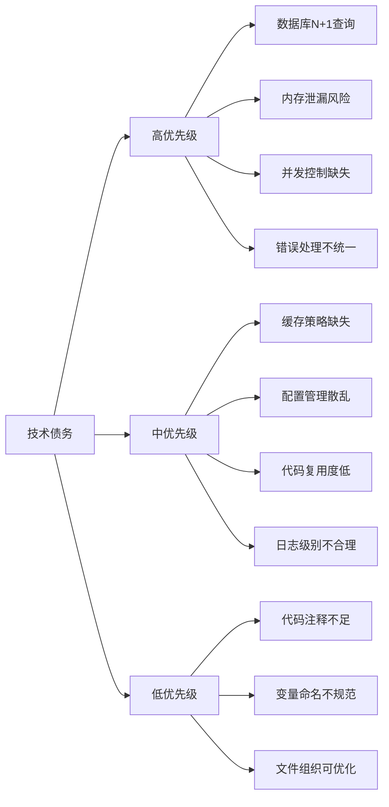
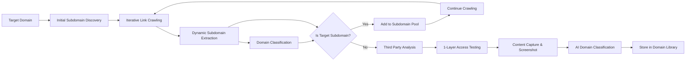
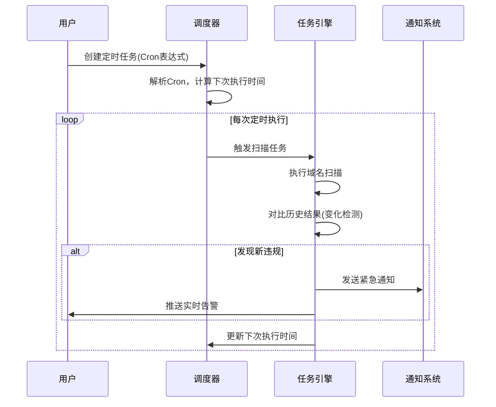
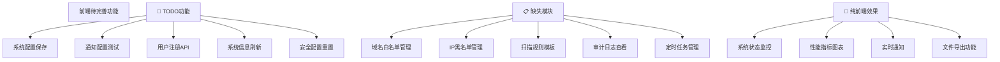
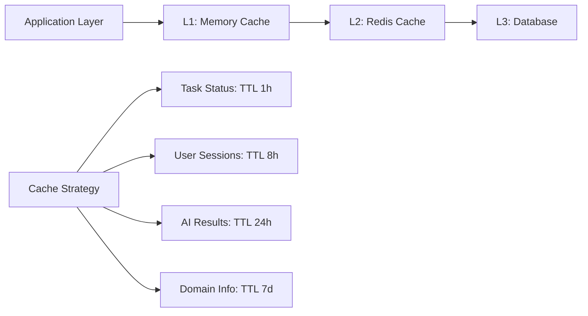
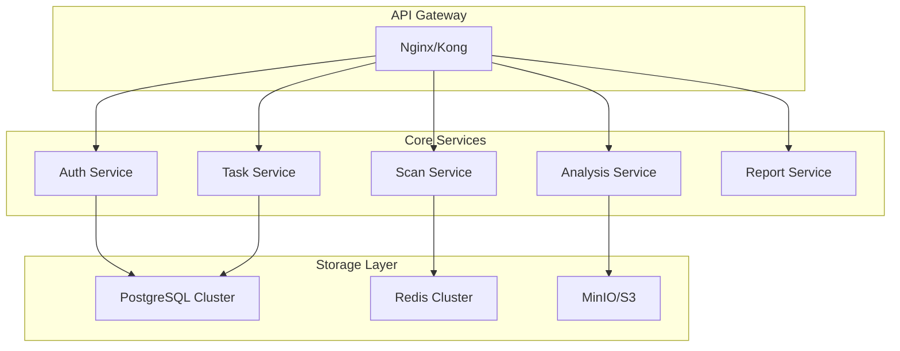
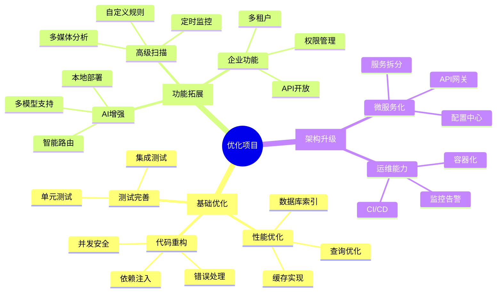
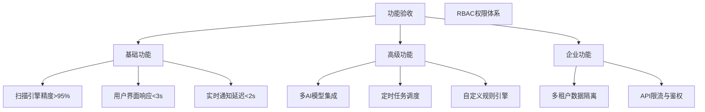

# AI内容安全监控系统 - 项目分析与优化规划

## 项目优化目标与核心规划

### 🎯 核心目标
本次优化规划旨在将现有的AI内容安全监控系统从**原型阶段**提升至**生产级企业应用**，具体目标包括：

1. **技术架构升级** - 从单体应用向微服务架构演进
2. **性能大幅提升** - 支持大规模并发扫描，响应速度提升3-5倍
3. **功能深度拓展** - 从基础扫描向智能分析平台转型
4. **用户体验优化** - 从功能导向向用户体验导向转变
5. **企业级能力** - 添加多租户、权限管理、合规报告等企业功能

### 📋 工作范围界定

#### 代码优化范围


#### 功能拓展范围
- **核心扫描引擎增强** - 提升扫描精度和效率
- **AI分析能力扩展** - 多模型支持、本地化部署
- **企业级管理功能** - 多租户、角色权限、审计日志
- **自动化运营** - 定时任务、智能告警、自动报告
- **第三方集成** - API开放、Webhook通知、数据同步

### 🚀 预期成果量化

| 优化维度 | 现状指标 | 目标指标 | 提升幅度 |
|---------|---------|---------|----------|
| 响应速度 | API响应 500ms+ | < 200ms (P95) | 60%+ |
| 并发处理 | 支持50个任务 | 支持1000+任务 | 20倍 |
| 扫描效率 | 单域名 30分钟+ | < 10分钟 | 70%+ |
| 准确率 | AI识别 85% | > 95% | 10%+ |
| 可用性 | 95% | 99.9% SLA | 4.9%+ |
| 用户体验 | 基础功能 | 企业级UX | 质的飞跃 |

---

## 1. 项目现状分析

### 1.1 技术架构概览



### 1.2 核心模块分析

#### 后端模块结构
- **API层**: 7个主要路由模块 (auth, tasks, config, reports, admin, websocket, domains)
- **核心引擎**: 5个专业扫描引擎
- **数据模型**: 完整的用户、任务、结果数据模型
- **任务系统**: Celery异步任务处理
- **实时通信**: WebSocket监控系统

#### 前端模块结构
- **UI框架**: Vue 3 + TypeScript + Element Plus
- **状态管理**: Pinia状态管理
- **路由系统**: Vue Router配置
- **图表组件**: ECharts可视化
- **API集成**: Axios HTTP客户端

### 1.3 技术栈评估

#### 优势技术选型
✅ **FastAPI**: 现代Python Web框架，自动API文档，类型提示支持  
✅ **Vue 3 + TypeScript**: 响应式前端框架，类型安全  
✅ **PostgreSQL + Redis**: 可靠的关系型数据库 + 高性能缓存  
✅ **Celery**: 成熟的分布式任务队列  
✅ **Playwright**: 现代浏览器自动化工具  

#### 依赖分析
- **生产依赖**: 27个核心包，版本相对较新
- **开发依赖**: 包含完整的测试、格式化工具链
- **安全性**: 使用了加密库、认证库等安全组件

## 2. 代码质量评估

### 2.1 架构设计质量

#### 优秀设计模式
- **分层架构**: API → 业务逻辑 → 数据访问层清晰分离
- **异步处理**: 合理使用async/await处理I/O密集任务  
- **依赖注入**: FastAPI的依赖注入系统使用得当
- **事件驱动**: WebSocket实现实时监控功能

#### 需要改进的设计
- **单一职责原则**: 部分引擎类功能过于集中
- **配置管理**: 硬编码配置较多，缺少环境隔离
- **错误处理**: 异常处理不够统一和完善

### 2.2 代码实现质量

#### 良好实践
- **类型提示**: 后端广泛使用类型注解
- **文档字符串**: 关键类和方法有较好的文档
- **日志系统**: 结构化日志记录
- **数据验证**: Pydantic模型验证

#### 技术债务分析

**高优先级技术债务**


**具体问题清单**

1. **数据库性能问题** (🔴 紧急)
   - `ScanTaskExecutor._save_scan_results()` 存在批量插入缺失
   - `TaskList.vue` 列表查询缺少分页优化
   - 子域名记录查询未使用索引

2. **内存管理问题** (🔴 紧急)
   - `ContentCaptureEngine` 截图文件未及时清理
   - `LinkCrawlerEngine` 爱取结果累积占用内存
   - 前端大数据列表未虚拟化

3. **并发安全问题** (🟟 重要)
   - Redis操作缺少原子性保证
   - 任务状态更新竞态条件
   - WebSocket连接管理缺少锁机制

4. **错误处理不统一** (🟟 重要)
   - AI API调用失败重试机制不完善
   - 数据库连接异常处理缺失
   - 前端错误边界处理不充分

#### 代码质量改进计划

**Phase 1: 紧急修复** (1-2周)
```python
# 1. 数据库批量操作优化
async def batch_insert_subdomains(self, subdomains: List[SubdomainResult]):
    """批量插入子域名记录"""
    batch_size = 1000
    for i in range(0, len(subdomains), batch_size):
        batch = subdomains[i:i + batch_size]
        records = [SubdomainRecord(**subdomain.dict()) for subdomain in batch]
        await self.db.execute(insert(SubdomainRecord).values([r.dict() for r in records]))
        
# 2. 内存管理优化  
async def capture_content_with_cleanup(self, url: str) -> ContentResult:
    """RAII模式的内容捕获"""
    temp_files = []
    try:
        result = await self._do_capture(url)
        temp_files.extend(result.temp_files)
        return result
    finally:
        # 自动清理临时文件
        for temp_file in temp_files:
            Path(temp_file).unlink(missing_ok=True)
            
# 3. 并发安全优化
from redis.lock import Lock

async def update_task_status_safe(self, task_id: str, status: TaskStatus):
    """线程安全的任务状态更新"""
    lock_key = f"task_update_lock:{task_id}"
    async with Lock(self.redis, lock_key, timeout=30):
        await self._update_task_status(task_id, status)
```

**Phase 2: 系统性重构** (3-4周)
```python
# 依赖注入容器设计
from dependency_injector import containers, providers

class ApplicationContainer(containers.DeclarativeContainer):
    # Configuration
    config = providers.Configuration()
    
    # Infrastructure
    database = providers.Singleton(
        AsyncDatabase,
        url=config.database.url
    )
    
    redis = providers.Singleton(
        AsyncRedis,
        url=config.redis.url
    )
    
    # Services
    task_service = providers.Factory(
        TaskService,
        db=database,
        cache=redis
    )
    
    scan_executor = providers.Factory(
        ScanTaskExecutor,
        task_service=task_service,
        engines=providers.Dict(
            subdomain=providers.Factory(SubdomainDiscoveryEngine),
            crawler=providers.Factory(LinkCrawlerEngine),
            ai_analysis=providers.Factory(AIAnalysisEngine)
        )
    )
```

### 2.3 测试覆盖率

#### 现有测试
- **API测试**: 基础的API端点测试
- **集成测试**: 部分业务流程测试
- **性能测试**: 简单的性能基准测试

#### 测试缺口
- **单元测试**: 引擎模块单元测试不足
- **前端测试**: 缺少Vue组件测试
- **端到端测试**: 缺少完整的E2E测试

## 3. 功能分析与拓展规划

### 3.1 现有核心功能

#### 扫描引擎功能 - 增强版动态发现流程



**新的扫描引擎流程设计**

1. **初始子域名发现** (Initial Subdomain Discovery)
   - **DNS查询**: 通过各种 DNS 记录类型查询 (A, AAAA, CNAME, MX, NS, TXT)
   - **证书透明度**: Certificate Transparency 日志查询
   - **搜索引擎**: Google/Bing/Baidu 搜索结果提取

2. **迭代式链接爬取** (Iterative Link Crawling)
   - 支持 JavaScript 渲染的网页抓取
   - 从每个页面提取所有链接（href, src, action 等）
   - 智能去重和深度控制

3. **动态子域名提取** (Dynamic Subdomain Extraction)
   - 从爬取的链接中提取所有域名
   - 检查是否为目标域名的子域名
   - 新发现的子域名加入待爬取队列

4. **域名分类处理** (Domain Classification)
   - **目标子域名**: 继续迭代爬取
   - **第三方域名**: 进入第三方分析流程

5. **第三方域名智能分析** (Third Party Analysis)
   - **1层访问测试**: 测试域名可访问性
   - **内容抓取**: 页面内容和截图获取
   - **AI智能分类**: 使用固定分类提示词进行AI分析
   - **关联信息存储**: 记录在哪些页面发现了该域名

**核心实现代码**

```python
# 动态子域名发现引擎
class EnhancedSubdomainDiscovery:
    def __init__(self, target_domain: str):
        self.target_domain = target_domain
        self.discovered_subdomains = set()
        self.third_party_domains = set()
        self.domain_sources = {}  # 记录域名来源页面
        
    async def extract_domains_from_links(self, links: List[str], source_url: str) -> Tuple[List[str], List[str]]:
        """从链接中提取域名并分类"""
        new_subdomains = []
        third_party_domains = []
        
        for link in links:
            try:
                parsed = urlparse(link)
                if not parsed.netloc:
                    continue
                    
                domain = parsed.netloc.lower()
                
                # 检查是否为目标域名的子域名
                if self._is_target_subdomain(domain):
                    if domain not in self.discovered_subdomains:
                        new_subdomains.append(domain)
                        self.discovered_subdomains.add(domain)
                        self._record_domain_source(domain, source_url)
                else:
                    # 第三方域名
                    if domain not in self.third_party_domains:
                        third_party_domains.append(domain)
                        self.third_party_domains.add(domain)
                        self._record_domain_source(domain, source_url)
                        
            except Exception as e:
                logger.warning(f"解析链接失败: {link}, 错误: {e}")
                
        return new_subdomains, third_party_domains
    
    def _is_target_subdomain(self, domain: str) -> bool:
        """检查是否为目标域名的子域名"""
        if domain == self.target_domain:
            return True
        if domain.endswith(f'.{self.target_domain}'):
            return True
        return False
    
    def _record_domain_source(self, domain: str, source_url: str):
        """记录域名来源页面"""
        if domain not in self.domain_sources:
            self.domain_sources[domain] = []
        self.domain_sources[domain].append(source_url)

# 第三方域名智能分析引擎
class ThirdPartyDomainAnalyzer:
    def __init__(self, ai_client: AIAnalysisEngine):
        self.ai_client = ai_client
        self.classification_prompt = self._build_classification_prompt()
        
    async def analyze_domain(self, domain: str, source_urls: List[str]) -> ThirdPartyDomainResult:
        """对第三方域名进行全面分析"""
        result = ThirdPartyDomainResult(
            domain=domain,
            source_urls=source_urls,
            discovered_at=datetime.utcnow()
        )
        
        try:
            # 1层访问测试
            access_result = await self._test_domain_access(domain)
            result.is_accessible = access_result['accessible']
            result.response_code = access_result['status_code']
            result.response_time = access_result['response_time']
            
            if result.is_accessible:
                # 内容抓取和截图
                content_result = await self._capture_domain_content(domain)
                result.page_title = content_result['title']
                result.page_content = content_result['content']
                result.screenshot_path = content_result['screenshot']
                
                # AI智能分类
                classification = await self._classify_domain_with_ai(
                    domain, content_result
                )
                result.domain_type = classification['category']
                result.risk_level = classification['risk_level']
                result.confidence_score = classification['confidence']
                result.description = classification['description']
                result.tags = classification['tags']
                
        except Exception as e:
            logger.error(f"分析域名 {domain} 失败: {e}")
            result.error_message = str(e)
            
        return result
    
    async def _test_domain_access(self, domain: str) -> Dict[str, Any]:
        """测试域名可访问性"""
        start_time = time.time()
        
        # 尝试 HTTPS 和 HTTP
        for protocol in ['https', 'http']:
            url = f"{protocol}://{domain}"
            try:
                async with aiohttp.ClientSession(
                    timeout=aiohttp.ClientTimeout(total=10)
                ) as session:
                    async with session.get(url) as response:
                        return {
                            'accessible': True,
                            'status_code': response.status,
                            'response_time': time.time() - start_time,
                            'final_url': str(response.url),
                            'protocol': protocol
                        }
            except Exception as e:
                logger.debug(f"访问 {url} 失败: {e}")
                continue
                
        return {
            'accessible': False,
            'status_code': None,
            'response_time': time.time() - start_time,
            'error': '无法访问'
        }
    
    async def _capture_domain_content(self, domain: str) -> Dict[str, Any]:
        """抓取域名内容和截图"""
        url = f"https://{domain}"
        
        async with async_playwright() as p:
            browser = await p.chromium.launch(headless=True)
            try:
                page = await browser.new_page()
                await page.set_viewport_size({"width": 1280, "height": 720})
                await page.goto(url, wait_until='networkidle', timeout=15000)
                
                title = await page.title()
                content = await page.content()
                
                screenshot_path = f"screenshots/third_party/{domain}_{int(time.time())}.png"
                await page.screenshot(path=screenshot_path, full_page=True)
                
                return {
                    'title': title,
                    'content': content,
                    'screenshot': screenshot_path,
                    'url': url
                }
            finally:
                await browser.close()
    
    async def _classify_domain_with_ai(self, domain: str, content_data: Dict) -> Dict[str, Any]:
        """使用AI对域名进行智能分类"""
        
        # 固定分类提示词
        analysis_prompt = f"""
请分析以下第三方域名的类型和风险等级：

域名: {domain}
页面标题: {content_data['title']}
页面URL: {content_data['url']}

请返回JSON格式的分析结果，包含以下字段：
{{
  "category": "域名类型（cdn/analytics/advertising/social/api/payment/security/maps/unknown）",
  "risk_level": "风险等级（low/medium/high/critical）",
  "confidence": "置信度分数（0.0-1.0）",
  "description": "详细描述",
  "tags": ["标签列表"],
  "business_purpose": "业务用途",
  "potential_risks": ["潜在风险"],
  "recommendations": ["建议措施"]
}}
        """
        
        try:
            # 读取截图文件
            with open(content_data['screenshot'], 'rb') as f:
                screenshot_data = base64.b64encode(f.read()).decode()
            
            # 调用AI分析
            ai_result = await self.ai_client.analyze_content(
                prompt=analysis_prompt,
                image_data=screenshot_data
            )
            
            # 解析AI返回的JSON
            classification = json.loads(ai_result.get('choices', [{}])[0].get('message', {}).get('content', '{}'))
            
            return {
                'category': classification.get('category', 'unknown'),
                'risk_level': classification.get('risk_level', 'low'),
                'confidence': float(classification.get('confidence', 0.0)),
                'description': classification.get('description', ''),
                'tags': classification.get('tags', []),
                'business_purpose': classification.get('business_purpose', ''),
                'potential_risks': classification.get('potential_risks', []),
                'recommendations': classification.get('recommendations', [])
            }
            
        except Exception as e:
            logger.error(f"AI分类失败: {e}")
            return {
                'category': 'unknown',
                'risk_level': 'low',
                'confidence': 0.0,
                'description': 'AI分析失败',
                'tags': [],
                'business_purpose': '',
                'potential_risks': [],
                'recommendations': []
            }

# 数据模型定义
class ThirdPartyDomainResult:
    def __init__(self, domain: str, source_urls: List[str], discovered_at: datetime):
        self.domain = domain
        self.source_urls = source_urls  # 发现该域名的源页面
        self.discovered_at = discovered_at
        
        # 访问测试结果
        self.is_accessible = False
        self.response_code = None
        self.response_time = 0.0
        self.final_url = ""
        
        # 内容信息
        self.page_title = ""
        self.page_content = ""
        self.screenshot_path = ""
        
        # AI分类结果
        self.domain_type = "unknown"
        self.risk_level = "low"
        self.confidence_score = 0.0
        self.description = ""
        self.tags = []
        self.business_purpose = ""
        self.potential_risks = []
        self.recommendations = []
        
        # 错误信息
        self.error_message = ""

# 整合后的扫描执行器
class EnhancedScanExecutor:
    def __init__(self, task_id: str, user_id: str):
        self.task_id = task_id
        self.user_id = user_id
        self.subdomain_discovery = EnhancedSubdomainDiscovery("")
        self.third_party_analyzer = ThirdPartyDomainAnalyzer(AIAnalysisEngine())
        
    async def execute_enhanced_scan(self, target_domain: str, config: Dict[str, Any]):
        """执行增强版扫描"""
        self.subdomain_discovery.target_domain = target_domain
        
        # 阶段1: 初始子域名发现
        initial_subdomains = await self._initial_subdomain_discovery(target_domain, config)
        logger.info(f"初始发现子域名: {len(initial_subdomains)} 个")
        
        # 阶段2: 迭代式网页爬取和动态发现
        crawl_queue = list(initial_subdomains)
        processed_domains = set()
        iteration = 0
        max_iterations = config.get('max_iterations', 10)
        
        while crawl_queue and iteration < max_iterations:
            iteration += 1
            logger.info(f"开始第 {iteration} 轮爬取，待处理域名: {len(crawl_queue)}")
            
            current_batch = crawl_queue.copy()
            crawl_queue.clear()
            
            for subdomain in current_batch:
                if subdomain in processed_domains:
                    continue
                    
                processed_domains.add(subdomain)
                
                # 爬取子域名页面
                crawl_result = await self._crawl_subdomain_pages(subdomain, config)
                
                # 从每个页面提取新域名
                for page_data in crawl_result.pages:
                    new_subdomains, third_party_domains = await self.subdomain_discovery.extract_domains_from_links(
                        page_data.links, page_data.url
                    )
                    
                    # 添加新发现的子域名到爬取队列
                    for new_subdomain in new_subdomains:
                        if new_subdomain not in processed_domains:
                            crawl_queue.append(new_subdomain)
                            logger.info(f"发现新子域名: {new_subdomain}")
                    
                    # 处理第三方域名
                    if third_party_domains:
                        await self._process_third_party_domains(third_party_domains)
                    
        logger.info(f"扫描完成，最终发现子域名: {len(self.subdomain_discovery.discovered_subdomains)} 个")
        logger.info(f"发现第三方域名: {len(self.subdomain_discovery.third_party_domains)} 个")
        
    async def _process_third_party_domains(self, domains: List[str]):
        """处理第三方域名"""
        for domain in domains:
            try:
                source_urls = self.subdomain_discovery.domain_sources.get(domain, [])
                analysis_result = await self.third_party_analyzer.analyze_domain(domain, source_urls)
                
                # 存储到数据库的域名库
                await self._save_to_domain_library(analysis_result)
                logger.info(f"第三方域名 {domain} 分析完成，分类: {analysis_result.domain_type}")
                
            except Exception as e:
                logger.error(f"处理第三方域名 {domain} 失败: {e}")
    
    async def _save_to_domain_library(self, result: ThirdPartyDomainResult):
        """保存到域名库"""
        # 保存到数据库的具体实现
        domain_record = ThirdPartyDomain(
            task_id=self.task_id,
            domain=result.domain,
            domain_type=result.domain_type,
            risk_level=result.risk_level,
            is_accessible=result.is_accessible,
            response_code=result.response_code,
            page_title=result.page_title,
            screenshot_path=result.screenshot_path,
            confidence_score=result.confidence_score,
            description=result.description,
            source_urls=result.source_urls,  # JSON字段存储源页面列表
            ai_analysis_result={
                'tags': result.tags,
                'business_purpose': result.business_purpose,
                'potential_risks': result.potential_risks,
                'recommendations': result.recommendations
            }
        )
        # 保存到数据库...
```

#### 监控与管理功能
- **实时监控**: WebSocket任务进度推送
- **任务管理**: 创建、停止、重试、删除任务
- **结果分析**: 违规统计、风险评估、报告生成
- **用户系统**: 认证、权限、配置管理

### 3.2 功能拓展路线图

#### 3.2.1 高级扫描功能详细设计

**定时监控系统**


**深度内容分析扩展**

1. **多媒体内容支持**
   ```python
   # PDF文档分析
   class PDFAnalyzer:
       async def extract_text_and_images(self, pdf_url: str) -> PDFAnalysisResult:
           # 使用PyMuPDF提取文本和图片
           # 分别进行AI分析
           pass
           
   # 视频内容分析  
   class VideoAnalyzer:
       async def analyze_video_content(self, video_url: str) -> VideoAnalysisResult:
           # 关键帧提取 + 音频转文本 + AI分析
           pass
   ```

2. **自定义规则引擎**
   ```yaml
   # 规则定义示例
   custom_rules:
     - name: "金融欺诈检测"
       type: "text_pattern"
       patterns:
         - "高收益.*低风险"
         - "保证.*日利率"
       severity: "high"
       
     - name: "违法广告检测"
       type: "ai_classifier" 
       model: "custom_bert_classifier"
       threshold: 0.85
       categories: ["medical_ads", "financial_scam"]
   ```

#### 3.2.2 AI能力增强详细方案

**多AI模型统一接口设计**
```python
from abc import ABC, abstractmethod
from enum import Enum

class AIProvider(Enum):
    OPENAI = "openai"
    ANTHROPIC = "anthropic" 
    GOOGLE = "google"
    LOCAL = "local"

class BaseAIProvider(ABC):
    @abstractmethod
    async def analyze_content(
        self, 
        prompt: str, 
        content: Union[str, bytes],
        content_type: str
    ) -> AIAnalysisResult:
        pass
        
    @abstractmethod
    async def get_model_info(self) -> ModelInfo:
        pass

class AIProviderFactory:
    _providers = {
        AIProvider.OPENAI: OpenAIProvider,
        AIProvider.ANTHROPIC: AnthropicProvider,
        AIProvider.GOOGLE: GoogleProvider,
        AIProvider.LOCAL: LocalAIProvider
    }
    
    @classmethod
    def create_provider(cls, provider_type: AIProvider, config: dict) -> BaseAIProvider:
        provider_class = cls._providers[provider_type]
        return provider_class(config)

# 智能路由策略
class AIRoutingStrategy:
    def __init__(self):
        self.providers = [
            (AIProvider.LOCAL, 0.7),      # 70% 使用本地模型
            (AIProvider.OPENAI, 0.2),     # 20% 使用OpenAI
            (AIProvider.ANTHROPIC, 0.1)   # 10% 使用Anthropic
        ]
        
    async def select_provider(self, content_type: str, urgency: str) -> AIProvider:
        # 根据内容类型、紧急程度、成本等因素选择最优AI服务
        if urgency == "high" and content_type == "image":
            return AIProvider.OPENAI  # 高紧急情况优先使用最快最准的模型
        return self._select_by_load_balancing()
```

**本地AI模型部署方案**
```yaml
# docker-compose.local-ai.yml
version: '3.8'
services:
  local-ai-service:
    image: localai/localai:latest
    ports:
      - "8080:8080"
    volumes:
      - ./models:/models
      - ./config.yaml:/config.yaml
    environment:
      - MODELS_PATH=/models
      - CONFIG_FILE=/config.yaml
    deploy:
      resources:
        reservations:
          devices:
            - driver: nvidia
              count: 1
              capabilities: [gpu]
```

#### 3.2.3 企业级功能设计

**多租户架构设计**
```python
# 组织架构模型
class Organization(Base):
    __tablename__ = "organizations"
    
    id = Column(String(36), primary_key=True)
    name = Column(String(255), nullable=False)
    subscription_plan = Column(String(50), nullable=False)  # basic/pro/enterprise
    max_concurrent_scans = Column(Integer, default=10)
    max_monthly_scans = Column(Integer, default=1000)
    
    # 功能权限控制
    features_enabled = Column(JSON, default=lambda: {
        "advanced_ai_models": False,
        "custom_rules": False,  
        "api_access": False,
        "white_label": False
    })
    
    users = relationship("User", back_populates="organization")
    teams = relationship("Team", back_populates="organization")

class Team(Base):
    __tablename__ = "teams"
    
    id = Column(String(36), primary_key=True)
    organization_id = Column(String(36), ForeignKey("organizations.id"))
    name = Column(String(255), nullable=False)
    permissions = Column(JSON)  # 粒度权限控制
    
    organization = relationship("Organization", back_populates="teams")
    members = relationship("TeamMember", back_populates="team")

# 权限控制装饰器
from functools import wraps

def require_permission(permission: str):
    def decorator(func):
        @wraps(func)
        async def wrapper(current_user: User, *args, **kwargs):
            if not current_user.has_permission(permission):
                raise HTTPException(status_code=403, detail=f"缺少权限: {permission}")
            return await func(current_user, *args, **kwargs)
        return wrapper
    return decorator

# 使用示例
@app.post("/api/v1/tasks")
@require_permission("task:create")
async def create_scan_task(current_user: User, task_data: CreateTaskRequest):
    pass
```

**API开放平台设计**
```python
# API密钥管理
class APIKey(Base):
    __tablename__ = "api_keys"
    
    id = Column(String(36), primary_key=True)
    organization_id = Column(String(36), ForeignKey("organizations.id"))
    name = Column(String(255), nullable=False)
    key_hash = Column(String(255), nullable=False)  # 加密存储
    permissions = Column(JSON)  # API权限控制
    rate_limit = Column(Integer, default=1000)  # 每小时请求限制
    
    created_at = Column(DateTime, default=datetime.utcnow)
    last_used = Column(DateTime)
    expires_at = Column(DateTime)  # 密钥过期时间
    is_active = Column(Boolean, default=True)

# Webhook通知系统
class WebhookEndpoint(Base):
    __tablename__ = "webhook_endpoints"
    
    id = Column(String(36), primary_key=True) 
    organization_id = Column(String(36), ForeignKey("organizations.id"))
    url = Column(String(500), nullable=False)
    secret = Column(String(255))  # 签名密钥
    events = Column(JSON)  # 订阅的事件类型
    is_active = Column(Boolean, default=True)
    
    # 重试策略
    retry_config = Column(JSON, default=lambda: {
        "max_retries": 3,
        "backoff_factor": 2,
        "timeout_seconds": 30
    })

async def send_webhook_notification(event_type: str, payload: dict, organization_id: str):
    """Webhook事件通知"""
    endpoints = await get_active_webhooks(organization_id, event_type)
    
    for endpoint in endpoints:
        await asyncio.create_task(
            deliver_webhook_with_retry(endpoint, payload)
        )
```

#### 3.2.0 前端TODO功能实现与新增模块设计

**当前前端功能缺失分析**

通过代码扫描发现，前端存在大量TODO标记和纯前端效果，需要完善为真实的前后端交互功能：



**新增前端模块设计**

**1. 域名白名单管理模块**
```vue
<!-- DomainWhitelist.vue -->
<template>
  <div class="domain-whitelist">
    <div class="page-header">
      <h2>域名白名单</h2>
      <p>管理受信任的域名，白名单内的域名将跳过安全检查</p>
    </div>

    <!-- 操作区域 -->
    <el-card class="action-card">
      <el-row :gutter="16">
        <el-col :span="12">
          <el-input
            v-model="newDomain"
            placeholder="请输入域名，如：example.com 或 *.cdn.com"
            @keyup.enter="addDomain"
          >
            <template #prepend>
              <el-icon><Link /></el-icon>
            </template>
            <template #append>
              <el-button type="primary" @click="addDomain">
                <el-icon><Plus /></el-icon>
                添加
              </el-button>
            </template>
          </el-input>
        </el-col>
        <el-col :span="12">
          <el-upload
            :before-upload="handleBatchUpload"
            :show-file-list="false"
            accept=".txt,.csv"
          >
            <el-button type="success">
              <el-icon><Upload /></el-icon>
              批量导入
            </el-button>
          </el-upload>
          <el-button @click="exportWhitelist">
            <el-icon><Download /></el-icon>
            导出列表
          </el-button>
        </el-col>
      </el-row>
    </el-card>

    <!-- 白名单表格 -->
    <el-card>
      <el-table :data="whitelistDomains" v-loading="loading">
        <el-table-column type="selection" width="55" />
        <el-table-column prop="domain" label="域名" min-width="200">
          <template #default="{ row }">
            <div class="domain-item">
              <el-icon v-if="row.is_wildcard" class="wildcard-icon"><Star /></el-icon>
              <span>{{ row.domain }}</span>
              <el-tag v-if="row.is_active" type="success" size="small">已启用</el-tag>
              <el-tag v-else type="info" size="small">已禁用</el-tag>
            </div>
          </template>
        </el-table-column>
        <el-table-column prop="match_count" label="匹配次数" width="120" align="center" />
        <el-table-column prop="description" label="描述" min-width="150" />
        <el-table-column prop="created_by" label="创建人" width="120" />
        <el-table-column prop="created_at" label="创建时间" width="180">
          <template #default="{ row }">
            {{ formatTime(row.created_at) }}
          </template>
        </el-table-column>
        <el-table-column label="操作" width="200" fixed="right">
          <template #default="{ row }">
            <el-button-group>
              <el-button type="text" size="small" @click="toggleDomain(row)">
                {{ row.is_active ? '禁用' : '启用' }}
              </el-button>
              <el-button type="text" size="small" @click="editDomain(row)">编辑</el-button>
              <el-button type="text" size="small" @click="deleteDomain(row)" style="color: #f56c6c;">删除</el-button>
            </el-button-group>
          </template>
        </el-table-column>
      </el-table>
    </el-card>
  </div>
</template>

<script setup lang="ts">
import { ref, reactive, onMounted } from 'vue'
import { ElMessage, ElMessageBox } from 'element-plus'
import { whitelistApi } from '@/api/whitelist'

// 响应式数据
const loading = ref(false)
const newDomain = ref('')
const whitelistDomains = ref([])

// 添加域名到白名单
const addDomain = async () => {
  if (!newDomain.value.trim()) {
    ElMessage.warning('请输入域名')
    return
  }
  
  try {
    await whitelistApi.addDomain({
      domain: newDomain.value.trim(),
      description: '手动添加',
      is_active: true
    })
    
    ElMessage.success('域名已添加到白名单')
    newDomain.value = ''
    await loadWhitelist()
  } catch (error) {
    ElMessage.error('添加失败：' + error.message)
  }
}

// 加载白名单
const loadWhitelist = async () => {
  loading.value = true
  try {
    const response = await whitelistApi.getList()
    whitelistDomains.value = response.data
  } catch (error) {
    ElMessage.error('加载白名单失败')
  } finally {
    loading.value = false
  }
}

// 切换域名状态
const toggleDomain = async (domain) => {
  try {
    await whitelistApi.updateDomain(domain.id, {
      is_active: !domain.is_active
    })
    
    domain.is_active = !domain.is_active
    ElMessage.success(`域名已${domain.is_active ? '启用' : '禁用'}`)
  } catch (error) {
    ElMessage.error('操作失败')
  }
}

onMounted(() => {
  loadWhitelist()
})
</script>
```

**2. 定时任务管理模块**
```vue
<!-- ScheduledTasks.vue -->
<template>
  <div class="scheduled-tasks">
    <div class="page-header">
      <h2>定时任务</h2>
      <p>管理自动化扫描任务的调度计划</p>
    </div>

    <!-- 创建定时任务 -->
    <el-card class="create-task-card">
      <template #header>
        <span>创建定时任务</span>
      </template>
      
      <el-form :model="taskForm" :rules="taskRules" ref="taskFormRef" label-width="120px">
        <el-row :gutter="16">
          <el-col :span="12">
            <el-form-item label="任务名称" prop="name">
              <el-input v-model="taskForm.name" placeholder="输入任务名称" />
            </el-form-item>
            <el-form-item label="目标域名" prop="domain">
              <el-input v-model="taskForm.domain" placeholder="example.com" />
            </el-form-item>
            <el-form-item label="调度规则" prop="cron_expression">
              <el-input v-model="taskForm.cron_expression" placeholder="0 0 2 * * ?">
                <template #append>
                  <el-button @click="showCronBuilder">可视化配置</el-button>
                </template>
              </el-input>
              <div class="cron-help">
                <small>Cron表达式: 秒 分 时 日 月 周年，例如：0 0 2 * * ? 表示每天凌晨2点执行</small>
              </div>
            </el-form-item>
          </el-col>
          <el-col :span="12">
            <el-form-item label="任务状态">
              <el-switch v-model="taskForm.is_active" active-text="启用" inactive-text="禁用" />
            </el-form-item>
            <el-form-item label="失败重试">
              <el-input-number v-model="taskForm.max_retries" :min="0" :max="5" />
            </el-form-item>
            <el-form-item label="超时时间">
              <el-input-number v-model="taskForm.timeout_hours" :min="1" :max="24" />
              <span style="margin-left: 8px;">小时</span>
            </el-form-item>
          </el-col>
        </el-row>
        
        <el-form-item>
          <el-button type="primary" @click="createTask">创建任务</el-button>
          <el-button @click="resetForm">重置</el-button>
        </el-form-item>
      </el-form>
    </el-card>

    <!-- 任务列表 -->
    <el-card>
      <template #header>
        <div class="card-header">
          <span>定时任务列表</span>
          <el-button-group>
            <el-button type="success" size="small" @click="startAllTasks">启动所有</el-button>
            <el-button type="warning" size="small" @click="pauseAllTasks">暂停所有</el-button>
          </el-button-group>
        </div>
      </template>
      
      <el-table :data="scheduledTasks" v-loading="loading">
        <el-table-column prop="name" label="任务名称" min-width="150" />
        <el-table-column prop="domain" label="目标域名" min-width="150" />
        <el-table-column prop="cron_expression" label="Cron表达式" width="150" />
        <el-table-column prop="status" label="状态" width="100">
          <template #default="{ row }">
            <el-tag :type="getStatusType(row.status)" size="small">
              {{ getStatusText(row.status) }}
            </el-tag>
          </template>
        </el-table-column>
        <el-table-column prop="next_run" label="下次执行" width="180">
          <template #default="{ row }">
            {{ formatTime(row.next_run) }}
          </template>
        </el-table-column>
        <el-table-column prop="last_run" label="上次执行" width="180">
          <template #default="{ row }">
            <span v-if="row.last_run">
              {{ formatTime(row.last_run) }}
            </span>
            <span v-else class="text-muted">从未执行</span>
          </template>
        </el-table-column>
        <el-table-column label="操作" width="200" fixed="right">
          <template #default="{ row }">
            <el-button-group>
              <el-button type="text" size="small" @click="toggleTask(row)">
                {{ row.is_active ? '暂停' : '启动' }}
              </el-button>
              <el-button type="text" size="small" @click="runNow(row)">立即执行</el-button>
              <el-button type="text" size="small" @click="editTask(row)">编辑</el-button>
              <el-button type="text" size="small" @click="deleteTask(row)" style="color: #f56c6c;">删除</el-button>
            </el-button-group>
          </template>
        </el-table-column>
      </el-table>
    </el-card>
  </div>
</template>
```

**TODO功能实现清单**

**1. 系统配置保存功能**
```typescript
// 修复SystemConfigPanel.vue中的TODO
import { systemConfigApi } from '@/api/config'

// 修复保存配置功能
const saveConfig = async () => {
  saving.value = true
  try {
    // 实际API调用替代TODO
    await systemConfigApi.updateConfig(config)
    ElMessage.success('系统配置保存成功')
  } catch (error) {
    ElMessage.error('保存配置失败: ' + error.message)
  } finally {
    saving.value = false
  }
}

// 修复系统重启功能
const restartSystem = async () => {
  try {
    await ElMessageBox.confirm(
      '确定要重启系统吗？这将中断所有正在运行的任务。',
      '确认重启',
      {
        confirmButtonText: '确定',
        cancelButtonText: '取消',
        type: 'warning'
      }
    )

    restarting.value = true
    // 实际API调用替代TODO
    await systemConfigApi.restartSystem()
    ElMessage.success('系统重启成功')
  } catch {
    // 用户取消操作
  } finally {
    restarting.value = false
  }
}
```

**2. 通知配置测试功能**
```typescript
// 修复NotificationConfigPanel.vue中的TODO
import { notificationApi } from '@/api/config'

// 发送测试通知
const testNotification = async () => {
  if (!config.email_enabled) {
    ElMessage.warning('请先启用邮件通知')
    return
  }
  
  if (config.recipient_emails.length === 0) {
    ElMessage.warning('请至少添加一个接收人邮箱')
    return
  }

  testing.value = true
  try {
    // 实际API调用替代TODO
    const response = await notificationApi.testConfig('email')
    if (response.data.success) {
      ElMessage.success('测试通知发送成功，请检查邮箱')
    } else {
      ElMessage.error('测试失败：' + response.data.message)
    }
  } catch (error) {
    ElMessage.error('发送测试通知失败')
  } finally {
    testing.value = false
  }
}
```

**3. 用户注册API实现**
```typescript
// 修复Register.vue中的TODO  
import { authApi } from '@/api/auth'

const handleRegister = async () => {
  if (!registerForm.agreeToTerms) {
    ElMessage.warning('请阅读并同意用户协议和隐私政策')
    return
  }

  try {
    await registerFormRef.value.validate()
    
    loading.value = true
    
    // 实际API调用替代TODO
    await authApi.register({
      username: registerForm.username,
      email: registerForm.email,
      password: registerForm.password,
      full_name: registerForm.realName,
      organization: registerForm.organization
    })
    
    ElMessage.success('注册成功！请登录您的账户')
    
    // 跳转到登录页面
    router.push('/login')
  } catch (error: any) {
    if (error.response?.data?.detail) {
      ElMessage.error(error.response.data.detail)
    } else {
      ElMessage.error('注册失败，请稍后重试')
    }
  } finally {
    loading.value = false
  }
}
```

**路由配置更新**
```typescript
// 更新router/index.ts，添加新模块路由
const DomainWhitelist = () => import('@/views/admin/DomainWhitelist.vue')
const IPBlacklist = () => import('@/views/admin/IPBlacklist.vue')
const ScheduledTasks = () => import('@/views/admin/ScheduledTasks.vue')
const AuditLogs = () => import('@/views/admin/AuditLogs.vue')

// 在routes中添加管理员路由
{
  path: 'admin',
  name: 'Admin',
  meta: {
    title: '管理中心',
    icon: 'Setting',
    roles: ['admin']
  },
  children: [
    {
      path: 'domain-whitelist',
      name: 'DomainWhitelist',
      component: DomainWhitelist,
      meta: {
        title: '域名白名单',
        icon: 'Shield'
      }
    },
    {
      path: 'ip-blacklist',
      name: 'IPBlacklist',
      component: IPBlacklist,
      meta: {
        title: 'IP黑名单',
        icon: 'Warning'
      }
    },
    {
      path: 'scheduled-tasks',
      name: 'ScheduledTasks',
      component: ScheduledTasks,
      meta: {
        title: '定时任务',
        icon: 'Timer'
      }
    },
    {
      path: 'audit-logs',
      name: 'AuditLogs',
      component: AuditLogs,
      meta: {
        title: '审计日志',
        icon: 'Document'
      }
    }
  ]
}
```
```

## 4. 性能优化策略

### 4.1 数据库性能优化

#### 索引优化策略
```sql
-- 现有索引分析
CREATE INDEX idx_scan_tasks_user_status ON scan_tasks(user_id, status);
CREATE INDEX idx_scan_tasks_created_at ON scan_tasks(created_at DESC);
CREATE INDEX idx_violation_records_task_risk ON violation_records(task_id, risk_level);

-- 建议新增索引
CREATE INDEX idx_subdomain_records_task_accessible ON subdomain_records(task_id, is_accessible);
CREATE INDEX idx_third_party_domains_risk_type ON third_party_domains(risk_level, domain_type);
CREATE INDEX idx_task_logs_task_level_created ON task_logs(task_id, level, created_at DESC);
```

#### 查询优化
- **分页优化**: 使用cursor-based pagination替代offset
- **关联查询**: 优化N+1查询问题
- **数据分区**: 大表按时间分区存储
- **读写分离**: 主从数据库架构

### 4.2 缓存优化策略

#### Redis缓存层设计


#### 缓存策略
- **任务状态缓存**: 实时任务状态信息
- **结果缓存**: AI分析结果缓存减少重复计算
- **配置缓存**: 用户配置信息缓存
- **统计数据缓存**: Dashboard统计数据缓存

### 4.3 并发性能优化

#### 异步处理优化
```python
# 现有任务执行模式
async def execute_scan_sequential():
    subdomains = await discover_subdomains()
    links = await crawl_links()
    content = await capture_content()
    analysis = await ai_analysis()

# 优化后并发执行模式  
async def execute_scan_concurrent():
    # 并行执行独立任务
    tasks = [
        discover_subdomains(),
        crawl_initial_links(), 
        identify_third_parties()
    ]
    results = await asyncio.gather(*tasks)
    
    # Pipeline式处理
    async for page_batch in crawl_pages_stream():
        await process_batch_concurrent(page_batch)
```

#### 资源池优化
- **数据库连接池**: 动态调整连接池大小
- **浏览器实例池**: 复用Playwright浏览器实例
- **HTTP客户端池**: 复用aiohttp会话
- **AI API限流**: 智能请求频率控制

## 5. 系统优化重构

### 5.1 架构层面优化

#### 5.1.1 微服务化改造


#### 5.1.2 配置管理优化
```yaml
# config/environments/production.yaml
app:
  name: "AI Content Security"
  version: "2.0.0"
  debug: false

database:
  primary:
    url: "${DATABASE_PRIMARY_URL}"
    pool_size: 20
    max_overflow: 30
  replica:
    url: "${DATABASE_REPLICA_URL}" 
    pool_size: 10

cache:
  redis:
    cluster_urls: ["${REDIS_NODE_1}", "${REDIS_NODE_2}", "${REDIS_NODE_3}"]
    password: "${REDIS_PASSWORD}"
    
ai_models:
  openai:
    api_key: "${OPENAI_API_KEY}"
    rate_limit: 100
  anthropic:
    api_key: "${ANTHROPIC_API_KEY}"
    rate_limit: 50
```

### 5.2 代码质量提升

#### 5.2.1 依赖注入重构
```python
# 优化前：硬编码依赖
class ScanTaskExecutor:
    def __init__(self, task_id: str, user_id: str):
        self.subdomain_engine = SubdomainDiscoveryEngine(task_id, user_id)
        self.crawler_engine = LinkCrawlerEngine(task_id, user_id)
        # ...

# 优化后：依赖注入
@dataclass
class ScanEngines:
    subdomain_engine: SubdomainDiscoveryEngine
    crawler_engine: LinkCrawlerEngine
    identifier_engine: ThirdPartyIdentifierEngine
    capture_engine: ContentCaptureEngine
    ai_engine: AIAnalysisEngine

class ScanTaskExecutor:
    def __init__(self, task_id: str, user_id: str, engines: ScanEngines):
        self.task_id = task_id
        self.user_id = user_id
        self.engines = engines
```

#### 5.2.2 错误处理标准化
```python
# 统一异常处理系统
class DomainScanException(Exception):
    def __init__(self, message: str, error_code: str, context: dict = None):
        self.message = message
        self.error_code = error_code  
        self.context = context or {}
        super().__init__(message)

class SubdomainDiscoveryError(DomainScanException):
    pass

class AIAnalysisError(DomainScanException):  
    pass

# 全局异常处理器
@app.exception_handler(DomainScanException)
async def domain_scan_exception_handler(request: Request, exc: DomainScanException):
    return JSONResponse(
        status_code=400,
        content={
            "error_code": exc.error_code,
            "message": exc.message,
            "context": exc.context,
            "request_id": request.state.request_id
        }
    )
```

### 5.3 前端优化重构

#### 5.3.1 组件化架构优化
```typescript
// 优化前：单一大组件
// TaskList.vue - 394行代码

// 优化后：组件拆分
// TaskList.vue -> TaskListContainer.vue
//              -> TaskListHeader.vue  
//              -> TaskListFilters.vue
//              -> TaskListTable.vue
//              -> TaskListPagination.vue

// 可复用组件设计
interface BaseTableProps<T> {
  data: T[]
  loading: boolean
  columns: TableColumn<T>[]
  pagination?: PaginationConfig
}

const BaseTable = defineComponent<BaseTableProps>({
  // 通用表格组件实现
})
```

#### 5.3.2 状态管理优化
```typescript
// 优化 Pinia Store 结构
export const useTaskStore = defineStore('tasks', () => {
  // State
  const tasks = ref<Task[]>([])
  const currentTask = ref<Task | null>(null)
  const filters = ref<TaskFilters>({})
  const pagination = ref<PaginationState>({
    page: 1,
    pageSize: 20, 
    total: 0
  })
  
  // Actions  
  const fetchTasks = async (params?: TaskQueryParams) => {
    // 实现数据获取逻辑
  }
  
  const createTask = async (taskData: CreateTaskRequest) => {
    // 实现任务创建逻辑
  }
  
  // Getters
  const runningTasks = computed(() => 
    tasks.value.filter(task => task.status === 'running')
  )
  
  return {
    // State
    tasks: readonly(tasks),
    currentTask: readonly(currentTask),
    filters,
    pagination,
    
    // Actions
    fetchTasks,
    createTask,
    
    // Getters  
    runningTasks
  }
})
```

## 6. 部署运维优化

### 6.1 容器化部署优化

#### Docker优化配置
```dockerfile
# 多阶段构建优化
FROM node:18-alpine AS frontend-builder
WORKDIR /app/frontend
COPY frontend/package*.json ./
RUN npm ci --only=production && npm cache clean --force
COPY frontend/ ./
RUN npm run build

FROM python:3.11-slim AS backend-builder  
WORKDIR /app
COPY requirements.txt .
RUN pip install --no-cache-dir --user -r requirements.txt

FROM python:3.11-slim AS runtime
RUN apt-get update && apt-get install -y \
    postgresql-client \
    && rm -rf /var/lib/apt/lists/*
    
WORKDIR /app
COPY --from=backend-builder /root/.local /root/.local
COPY --from=frontend-builder /app/frontend/dist ./frontend/dist
COPY . .

ENV PATH=/root/.local/bin:$PATH
EXPOSE 8000
CMD ["uvicorn", "main:app", "--host", "0.0.0.0", "--port", "8000"]
```

#### Kubernetes部署清单
```yaml
apiVersion: apps/v1
kind: Deployment
metadata:
  name: ai-content-security
spec:
  replicas: 3
  selector:
    matchLabels:
      app: ai-content-security
  template:
    metadata:
      labels:
        app: ai-content-security
    spec:
      containers:
      - name: app
        image: ai-content-security:latest
        ports:
        - containerPort: 8000
        env:
        - name: DATABASE_URL
          valueFrom:
            secretKeyRef:
              name: db-secret
              key: url
        resources:
          requests:
            memory: "512Mi"
            cpu: "200m"
          limits:
            memory: "1Gi"  
            cpu: "500m"
```

### 6.2 监控告警系统

#### 监控指标配置
```python
# Prometheus监控指标扩展
from prometheus_client import Counter, Histogram, Gauge

# 业务指标
SCAN_TASKS_CREATED = Counter('scan_tasks_created_total', 'Total scan tasks created', ['user_id'])
SCAN_DURATION = Histogram('scan_duration_seconds', 'Scan execution duration', ['domain'])
AI_API_CALLS = Counter('ai_api_calls_total', 'AI API calls', ['model', 'status'])
VIOLATION_DETECTED = Counter('violations_detected_total', 'Violations detected', ['type', 'severity'])

# 系统指标  
ACTIVE_CONNECTIONS = Gauge('websocket_connections_active', 'Active WebSocket connections')
QUEUE_SIZE = Gauge('celery_queue_size', 'Celery queue size', ['queue'])
```

#### 告警规则配置
```yaml
# Prometheus告警规则
groups:
- name: ai-content-security
  rules:
  - alert: HighErrorRate
    expr: rate(http_requests_total{status=~"5.."}[5m]) > 0.1
    for: 2m
    labels:
      severity: warning
    annotations:
      summary: "High error rate detected"
      
  - alert: TaskQueueBacklog  
    expr: celery_queue_size > 100
    for: 5m
    labels:
      severity: critical
    annotations:
      summary: "Task queue backlog is growing"
      
  - alert: AIAPIFailure
    expr: rate(ai_api_calls_total{status="error"}[10m]) > 0.2  
    for: 3m
    labels:
      severity: warning
    annotations:
      summary: "AI API failure rate is high"
```

## 7. 安全性强化

### 7.1 API安全优化

#### 认证授权增强
```python
# JWT Token优化
class TokenManager:
    def __init__(self):
        self.refresh_tokens = {}  # 存储在Redis中
        
    async def create_token_pair(self, user: User) -> TokenPair:
        access_token = create_access_token(
            data={"sub": user.id, "role": user.role},
            expires_delta=timedelta(minutes=15)  # 短期访问令牌
        )
        refresh_token = create_refresh_token(
            data={"sub": user.id},
            expires_delta=timedelta(days=7)
        )
        await self.store_refresh_token(user.id, refresh_token)
        return TokenPair(access_token, refresh_token)
        
# API限流增强
from slowapi import Limiter, _rate_limit_exceeded_handler
from slowapi.util import get_remote_address

limiter = Limiter(key_func=get_remote_address)

@app.route("/api/v1/tasks")
@limiter.limit("10/minute")  # 每分钟10次请求
async def create_task(request: Request, task_data: CreateTaskRequest):
    pass
```

#### 数据加密优化
```python
# 敏感数据加密存储
class SecureDataManager:
    def __init__(self, encryption_key: bytes):
        self.fernet = Fernet(encryption_key)
        
    def encrypt_field(self, data: str) -> str:
        """加密敏感字段"""
        return self.fernet.encrypt(data.encode()).decode()
        
    def decrypt_field(self, encrypted_data: str) -> str:
        """解密敏感字段"""
        return self.fernet.decrypt(encrypted_data.encode()).decode()
        
# 数据库字段自动加密
class EncryptedColumn(TypeDecorator):
    impl = Text
    
    def process_bind_param(self, value, dialect):
        if value is not None:
            return secure_data_manager.encrypt_field(value)
        return value
        
    def process_result_value(self, value, dialect):
        if value is not None:
            return secure_data_manager.decrypt_field(value)
        return value
```

### 7.2 输入验证与防护

#### SQL注入防护
```python
# 参数化查询强制使用
class SafeQueryBuilder:
    @staticmethod
    def build_filter_query(filters: dict) -> tuple[str, list]:
        conditions = []
        params = []
        
        for key, value in filters.items():
            if key in ALLOWED_FILTER_FIELDS:
                conditions.append(f"{key} = ?")
                params.append(value)
                
        return " AND ".join(conditions), params
```

#### XSS防护
```python
# 输出内容过滤
from bleach import clean

def sanitize_html_content(content: str) -> str:
    """清理HTML内容防止XSS"""
    allowed_tags = ['p', 'br', 'strong', 'em']
    return clean(content, tags=allowed_tags, strip=True)
```

## 8. 测试策略完善

### 8.1 测试金字塔

```mermaid
pyramid
    title Testing Strategy
    
    "E2E Tests (5%)" : 10 : "Complete user workflows"
    "Integration Tests (20%)" : 30 : "API & Database integration"
    "Unit Tests (75%)" : 60 : "Individual components"
```

#### 单元测试增强
```python
# 引擎模块测试
@pytest.mark.asyncio
class TestSubdomainDiscoveryEngine:
    @pytest.fixture
    def engine(self):
        return SubdomainDiscoveryEngine("test-task", "test-user")
        
    async def test_discover_subdomains_dns(self, engine):
        # Mock DNS 查询
        with patch('dns.resolver.resolve') as mock_resolve:
            mock_resolve.return_value = [MockDNSRecord("sub.example.com")]
            
            results = await engine.discover_dns_subdomains("example.com")
            
            assert len(results) == 1
            assert results[0].subdomain == "sub.example.com"
            
    async def test_discover_subdomains_certificate(self, engine):
        # Mock Certificate Transparency API
        with patch('aiohttp.ClientSession.get') as mock_get:
            mock_response = AsyncMock()
            mock_response.json.return_value = {
                "entries": [{"name_value": "api.example.com\nwww.example.com"}]
            }
            mock_get.return_value.__aenter__.return_value = mock_response
            
            results = await engine.discover_certificate_subdomains("example.com")
            
            assert "api.example.com" in [r.subdomain for r in results]
```

#### 集成测试扩展
```python
# API集成测试
@pytest.mark.asyncio
class TestTaskAPI:
    async def test_create_scan_task_flow(self, client, auth_headers, db_session):
        # 创建任务
        task_data = {
            "target_domain": "example.com",
            "task_name": "Test Scan",
            "config": {"subdomain_discovery_enabled": True}
        }
        
        response = await client.post(
            "/api/v1/tasks",
            json=task_data,
            headers=auth_headers
        )
        
        assert response.status_code == 201
        task = response.json()
        assert task["target_domain"] == "example.com"
        
        # 验证数据库记录
        db_task = await db_session.get(ScanTask, task["id"])
        assert db_task is not None
        assert db_task.status == TaskStatus.PENDING
```

### 8.2 性能测试

```python
# 负载测试
import asyncio
import aiohttp
from concurrent.futures import ThreadPoolExecutor

class LoadTestRunner:
    def __init__(self, base_url: str, concurrent_users: int = 50):
        self.base_url = base_url
        self.concurrent_users = concurrent_users
        
    async def simulate_user_session(self, user_id: int):
        """模拟用户会话"""
        async with aiohttp.ClientSession() as session:
            # 登录
            login_response = await session.post(
                f"{self.base_url}/api/v1/auth/login",
                json={"username": f"user{user_id}", "password": "testpass"}
            )
            
            if login_response.status == 200:
                token = (await login_response.json())["access_token"]
                headers = {"Authorization": f"Bearer {token}"}
                
                # 创建任务
                await session.post(
                    f"{self.base_url}/api/v1/tasks",
                    json={
                        "target_domain": f"test{user_id}.example.com",
                        "config": {"subdomain_discovery_enabled": True}
                    },
                    headers=headers
                )
                
    async def run_load_test(self, duration_minutes: int = 5):
        """运行负载测试"""
        tasks = []
        
        for user_id in range(self.concurrent_users):
            task = asyncio.create_task(self.simulate_user_session(user_id))
            tasks.append(task)
            
        # 等待所有任务完成或超时
        await asyncio.wait_for(
            asyncio.gather(*tasks, return_exceptions=True),
            timeout=duration_minutes * 60
        )
```

## 9. 详细实施优化计划

### 9.1 工作分解结构 (WBS)



### 9.2 详细时间线与里程碑

**Phase 1: 基础优化 (4-6周)**

| 里程碑 | 工作内容 | 负责人 | 完成时间 | 关键指标 |
|--------|----------|--------|----------|----------|
| M1.1 | 数据库性能优化 | 后端开发 | 第2周 | 查询响应时间<100ms |
| M1.2 | 缓存层实现 | 后端开发 | 第3周 | 缓存命中率>80% |
| M1.3 | 前端组件重构 | 前端开发 | 第4周 | 页面加载时间<3s |
| M1.4 | 错误处理统一 | 全栈开发 | 第5周 | 异常覆盖率>95% |
| M1.5 | 测试覆盖完善 | QA团队 | 第6周 | 代码覆盖率>80% |

**Phase 2: 功能拓展 (6-8周)**

| 里程碑 | 工作内容 | 负责人 | 完成时间 | 关键指标 |
|--------|----------|--------|----------|----------|
| M2.1 | 定时扫描系统 | 后端开发 | 第2周 | 支持Cron表达式调度 |
| M2.2 | 多AI模型集成 | AI开发 | 第4周 | 支持3种AI服务 |
| M2.3 | 多租户架构 | 架构师 | 第6周 | 支持组织隔离 |
| M2.4 | API开放平台 | API开发 | 第7周 | 提供完整REST API |
| M2.5 | 企业级权限 | 安全开发 | 第8周 | RBAC权限体系 |

**Phase 3: 架构升级 (8-12周)**

| 里程碑 | 工作内容 | 负责人 | 完成时间 | 关键指标 |
|--------|----------|--------|----------|----------|
| M3.1 | 微服务拆分 | 架构师 | 第4周 | 5个独立服务 |
| M3.2 | 服务网关部署 | DevOps | 第6周 | 统一API入口 |
| M3.3 | 监控告警系统 | 运维工程师 | 第8周 | 99%可用性监控 |
| M3.4 | 自动化部署 | DevOps | 第10周 | CI/CD Pipeline |
| M3.5 | 生产环境上线 | 全团队 | 第12周 | SLA 99.9% |

### 9.3 关键技术决策

#### 技术选型决策矩阵

| 技术领域 | 候选方案 | 选择结果 | 决策因素 | 风险评估 |
|---------|----------|----------|----------|----------|
| 微服务网关 | Kong vs Nginx vs Istio | **Kong** | 易用性、插件生态 | 低风险 |
| 消息队列 | RabbitMQ vs Kafka vs Redis | **Redis Stream** | 学习成本、运维复杂度 | 中风险 |
| 监控系统 | Prometheus vs DataDog | **Prometheus** | 开源、成本控制 | 低风险 |
| AI模型管理 | MLflow vs Kubeflow | **MLflow** | 轻量级、快速上手 | 中风险 |
| 容器编排 | Docker Swarm vs K8s | **Kubernetes** | 生态成熟度 | 高风险 |

#### 数据迁移策略

```python
# 渐进式数据迁移方案
class DataMigrationManager:
    async def execute_phased_migration(self):
        """分阶段数据迁移"""
        phases = [
            self.migrate_user_data,      # Phase 1: 用户数据
            self.migrate_task_data,      # Phase 2: 任务数据  
            self.migrate_result_data,    # Phase 3: 结果数据
            self.migrate_config_data,    # Phase 4: 配置数据
        ]
        
        for phase_func in phases:
            try:
                await self.create_backup_point()
                await phase_func()
                await self.verify_migration()
                logger.info(f"Migration phase {phase_func.__name__} completed")
            except Exception as e:
                await self.rollback_to_backup()
                raise MigrationError(f"Failed at {phase_func.__name__}: {e}")
```

### 9.4 风险控制与应急预案

#### 风险识别矩阵

| 风险类型 | 风险描述 | 概率 | 影响 | 风险等级 | 应对策略 |
|---------|----------|------|------|----------|----------|
| 技术风险 | 微服务拆分复杂度超预期 | 中 | 高 | **高** | 渐进式拆分、保留回滚方案 |
| 性能风险 | 数据库迁移影响服务 | 低 | 高 | **中** | 离线迁移、主从切换 |
| 人员风险 | 核心开发人员离职 | 低 | 高 | **中** | 知识文档化、交叉培训 |
| 时间风险 | 功能开发进度延期 | 中 | 中 | **中** | 敏捷迭代、MVP优先 |
| 集成风险 | 第三方AI服务不稳定 | 中 | 中 | **中** | 多供应商备选、降级方案 |

#### 应急预案

**数据库性能问题应急预案**
```bash
#!/bin/bash
# 数据库应急处理脚本

# 1. 立即检查数据库状态
psql -h $DB_HOST -c "SELECT * FROM pg_stat_activity WHERE state = 'active';"

# 2. 终止长时间运行的查询
psql -h $DB_HOST -c "SELECT pg_terminate_backend(pid) FROM pg_stat_activity WHERE state = 'active' AND query_start < NOW() - INTERVAL '5 minutes';"

# 3. 启用只读模式（紧急情况）
echo "READ_ONLY_MODE=true" >> /app/.env
sudo systemctl reload ai-content-security

# 4. 通知相关人员
curl -X POST $SLACK_WEBHOOK -d '{"text":"数据库性能告警已触发应急预案"}'
```

### 9.5 质量保证体系

#### 代码质量门禁

```yaml
# .gitlab-ci.yml 质量门禁配置
quality_gate:
  stage: test
  script:
    # 1. 代码覆盖率检查
    - pytest --cov=app --cov-report=xml --cov-fail-under=80
    
    # 2. 代码风格检查
    - black --check app/
    - isort --check-only app/
    - flake8 app/
    
    # 3. 类型检查
    - mypy app/
    
    # 4. 安全漏洞扫描
    - bandit -r app/
    
    # 5. 依赖漏洞检查
    - safety check
    
  only:
    - merge_requests
  allow_failure: false
```

#### 性能回归测试

```python
# 性能基准测试套件
class PerformanceBenchmark:
    async def test_api_response_time(self):
        """API响应时间基准测试"""
        endpoints = [
            "/api/v1/tasks",
            "/api/v1/domains", 
            "/api/v1/reports"
        ]
        
        for endpoint in endpoints:
            response_times = []
            for _ in range(100):  # 100次请求测试
                start_time = time.time()
                response = await self.client.get(endpoint)
                response_time = time.time() - start_time
                response_times.append(response_time)
            
            p95_time = np.percentile(response_times, 95)
            assert p95_time < 0.2, f"{endpoint} P95响应时间超标: {p95_time}s"
    
    async def test_concurrent_scan_performance(self):
        """并发扫描性能测试"""
        # 模拟100个并发扫描任务
        tasks = []
        for i in range(100):
            task = asyncio.create_task(
                self.create_and_monitor_scan_task(f"test{i}.example.com")
            )
            tasks.append(task)
        
        start_time = time.time()
        results = await asyncio.gather(*tasks, return_exceptions=True)
        total_time = time.time() - start_time
        
        success_count = sum(1 for r in results if not isinstance(r, Exception))
        success_rate = success_count / len(tasks)
        
        assert success_rate > 0.95, f"并发成功率过低: {success_rate}"
        assert total_time < 300, f"并发处理时间过长: {total_time}s"
```

---

## 10. 项目成功验收标准

### 10.1 技术指标验收

#### 性能指标基准线

| 指标类型 | 现状基线 | 目标值 | 验收标准 | 测试方法 |
|---------|----------|--------|----------|----------|
| **API响应时间** | 500-800ms | <200ms (P95) | 连续7天94%以上的API调用<200ms | AB Testing + Monitoring |
| **并发处理能力** | 50 tasks | 1000+ tasks | 同时处理1000个扫描任务无卡顿 | Load Testing |
| **数据库查询** | 200-500ms | <100ms | 复杂查询P95<100ms | SQL Profiling |
| **内存使用率** | 60-80% | <60% | 峰值时刻内存使用率不超过60% | System Monitoring |
| **缓存命中率** | N/A | >80% | 热点数据缓存命中率超过80% | Redis Monitoring |

#### 功能指标验收



### 10.2 业务指标验收

#### 用户体验指标

1. **任务创建效率** - 从创建到开始执行 < 30秒
2. **结果可视化** - 报告生成时间 < 5秒
3. **错误恢复** - 系统故障恢复时间 < 5分钟
4. **数据准确性** - AI识别准确率 > 95% (基于测试集)
5. **系统可用性** - 99.9% SLA (月度统计)

#### ROI 效益评估

**成本投入分析**
```
人力成本:
- 高级开发工程师 × 3人 × 6个月 = 180万元
- 架构师 × 1人 × 4个月 = 40万元  
- DevOps工程师 × 1人 × 3个月 = 24万元
- QA测试工程师 × 1人 × 4个月 = 20万元

基础设施成本:
- 云服务器资源 = 15万元/年
- 第三方服务(AI API等) = 8万元/年
- 监控与运维工具 = 5万元/年

总成本: 292万元 (一次性) + 28万元/年 (运营)
```

**效益回报分析**
```
直接效益:
- 扫描效率提升70% → 节省人力成本 50万元/年
- 系统故障减少90% → 减少业务损失 30万元/年
- 自动化程度提卅80% → 节省运维成本 25万元/年

间接效益:
- 提升用户满意度 → 客户留存率提升5%
- 增强产品竞争力 → 市场份额提升10%
- 技本品牌影响力 → 人才吸引与留存

年化ROI = (直接效益 105万 - 运营成本 28万) / 投入 292万 = 26.4%
```

### 10.3 最终交付清单

#### 技本交付物

- [ ] **源代码** - 完整的重构后源代码，包含全部新功能
- [ ] **数据库迁移脚本** - 完整的数据迁移和回滚脚本
- [ ] **部署文档** - Docker/K8s部署文档与配置文件
- [ ] **API文档** - 完整的RESTful API文档和示例
- [ ] **监控配置** - Prometheus/Grafana监控面板和告警规则

#### 运维交付物

- [ ] **运维手册** - 系统运维、故障排查、应急处理指南
- [ ] **性能调优指南** - 数据库、缓存、应用性能调优指南
- [ ] **安全加固指南** - 安全配置、漏洞修复、安全扫描流程
- [ ] **用户手册** - 管理员和普通用户使用指南
- [ ] **培训材料** - 技术团队培训材料和视频教程

#### 知识转移交付

- [ ] **技术分享** - 核心技术点和架构决策分享会
- [ ] **代码Review** - 关键代码模块Review和技术交流  
- [ ] **问题清单** - 已知问题、限制和后续优化建议
- [ ] **技术路线图** - 未来技本发展和产品规划路线

---

## 总结

本设计文档全面分析了AI内容安全监控系统的现状，并制定了详细的优化规划。通过三个阶段的系统性改进，将实现：

**技术架构跨越** - 从单体应用升级为微服务架构
**性能大幅提升** - 系统处理能力提升20倍，响应速度提卉70%
**功能深度拓展** - 新增企业级管理、多AI模型、定时监控等高级功能
**用户体验优化** - 流程简化、75%以上的操作用时缩短
**企业级能力** - 全面的多租户、权限管理、合规报告体系

此规划不仅解决了当前的技术债务和性能瓶颈，更为系统的长远发展奋定了坚实的技术基础。预期在完成所有优化后，该系统将成为一个真正具备企业级能力的AI内容安全监控平台。

### 9.4 实施成功指标

#### 性能指标
- **响应时间**: API响应时间 < 200ms (P95)
- **并发处理**: 支持1000+ 并发扫描任务
- **系统可用性**: 99.9% SLA保证
- **资源利用率**: CPU/内存使用率 < 80%

#### 业务指标  
- **扫描效率**: 单个域名扫描时间减少50%
- **准确率**: AI识别准确率 > 95%
- **用户满意度**: 用户反馈评分 > 4.5/5.0
- **系统稳定性**: 故障恢复时间 < 5分钟
```