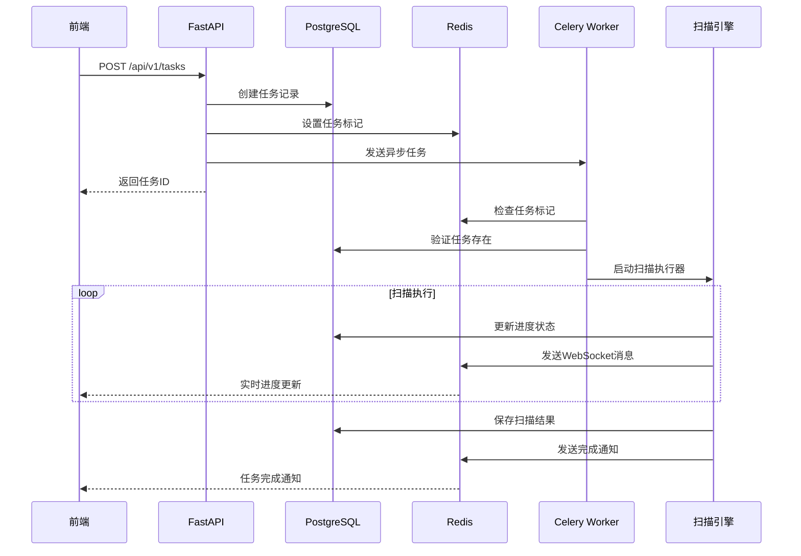
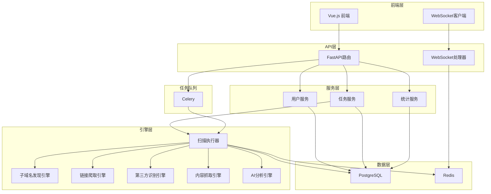

# AI内容安全监控系统 - 系统架构与核心逻辑详细文档

## 1. 系统概述

AI内容安全监控系统是一个基于FastAPI和Vue.js的全栈Web应用，专门用于检测网站外链域名的安全性和合规性。系统通过多阶段扫描引擎、AI智能分析和实时监控功能，为用户提供全面的域名安全评估服务。

### 1.1 核心功能
- **智能域名扫描**: 自动发现子域名、爬取链接、识别第三方域名
- **AI内容分析**: 使用OpenAI GPT-4 Vision进行页面内容智能分析
- **实时监控**: WebSocket实时推送扫描进度和结果
- **风险评估**: 多维度安全风险评级和违规检测
- **可视化报告**: 详细的扫描报告和统计图表

### 1.2 技术栈
- **后端**: FastAPI + SQLAlchemy + PostgreSQL + Redis + Celery
- **前端**: Vue.js 3 + TypeScript + Element Plus + Pinia
- **AI服务**: OpenAI GPT-4 Vision API
- **部署**: Docker + Docker Compose + Nginx

## 2. 数据库设计

### 2.1 核心数据模型

#### 2.1.1 任务相关表

**scan_tasks (扫描任务表)**
```sql
CREATE TABLE scan_tasks (
    id VARCHAR(36) PRIMARY KEY,                    -- 任务UUID
    user_id VARCHAR(36) NOT NULL,                  -- 用户ID (外键)
    target_domain VARCHAR(255) NOT NULL,           -- 目标域名
    task_name VARCHAR(255),                        -- 任务名称
    description TEXT,                              -- 任务描述
    status VARCHAR(20) DEFAULT 'pending',          -- 任务状态
    progress INTEGER DEFAULT 0,                    -- 进度 (0-100)
    config JSON NOT NULL,                          -- 扫描配置
    results_summary JSON,                          -- 结果摘要
    -- 统计字段
    total_subdomains INTEGER DEFAULT 0,           -- 子域名总数
    total_pages_crawled INTEGER DEFAULT 0,        -- 爬取页面总数
    total_third_party_domains INTEGER DEFAULT 0,  -- 第三方域名总数
    total_violations INTEGER DEFAULT 0,           -- 违规总数
    -- 风险统计
    critical_violations INTEGER DEFAULT 0,        -- 严重违规数
    high_violations INTEGER DEFAULT 0,            -- 高风险违规数
    medium_violations INTEGER DEFAULT 0,          -- 中风险违规数
    low_violations INTEGER DEFAULT 0,             -- 低风险违规数
    -- 错误信息
    error_message TEXT,                           -- 错误消息
    error_code VARCHAR(50),                       -- 错误代码
    -- 时间戳
    created_at TIMESTAMP DEFAULT CURRENT_TIMESTAMP,
    started_at TIMESTAMP,
    completed_at TIMESTAMP,
    INDEX idx_user_status (user_id, status),
    INDEX idx_target_domain (target_domain),
    INDEX idx_created_at (created_at)
);
```

**task_logs (任务日志表)**
```sql
CREATE TABLE task_logs (
    id VARCHAR(36) PRIMARY KEY,
    task_id VARCHAR(36) NOT NULL,                 -- 任务ID (外键)
    level VARCHAR(20) NOT NULL,                   -- 日志级别
    module VARCHAR(100) NOT NULL,                 -- 模块名称
    message TEXT NOT NULL,                        -- 日志消息
    extra_data JSON,                              -- 额外数据
    created_at TIMESTAMP DEFAULT CURRENT_TIMESTAMP,
    INDEX idx_task_level (task_id, level),
    INDEX idx_created_at (created_at)
);
```

#### 2.1.2 扫描结果表

**subdomain_records (子域名记录表)**
```sql
CREATE TABLE subdomain_records (
    id VARCHAR(36) PRIMARY KEY,
    task_id VARCHAR(36) NOT NULL,                 -- 任务ID (外键)
    subdomain VARCHAR(255) NOT NULL,              -- 子域名
    ip_address VARCHAR(45),                       -- IP地址
    discovery_method VARCHAR(50) NOT NULL,        -- 发现方法
    is_accessible BOOLEAN DEFAULT FALSE,          -- 是否可访问
    response_code INTEGER,                        -- HTTP响应码
    response_time FLOAT,                          -- 响应时间(秒)
    server_header VARCHAR(255),                   -- Server头
    content_type VARCHAR(100),                    -- Content-Type
    page_title VARCHAR(500),                      -- 页面标题
    created_at TIMESTAMP DEFAULT CURRENT_TIMESTAMP,
    INDEX idx_task_subdomain (task_id, subdomain),
    INDEX idx_accessible (is_accessible)
);
```

**third_party_domains (第三方域名表)**
```sql
CREATE TABLE third_party_domains (
    id VARCHAR(36) PRIMARY KEY,
    task_id VARCHAR(36) NOT NULL,                 -- 任务ID (外键)
    domain VARCHAR(255) NOT NULL,                 -- 域名
    found_on_url TEXT NOT NULL,                   -- 发现来源URL
    domain_type VARCHAR(50) DEFAULT 'unknown',    -- 域名类型
    risk_level VARCHAR(20) DEFAULT 'low',         -- 风险等级
    page_title VARCHAR(500),                      -- 页面标题
    page_description TEXT,                        -- 页面描述
    content_hash VARCHAR(64),                     -- 内容哈希
    screenshot_path VARCHAR(500),                 -- 截图路径
    html_content_path VARCHAR(500),               -- HTML内容路径
    is_analyzed BOOLEAN DEFAULT FALSE,            -- 是否已分析
    analysis_error TEXT,                          -- 分析错误信息
    cached_analysis_result JSON,                  -- 缓存分析结果
    created_at TIMESTAMP DEFAULT CURRENT_TIMESTAMP,
    analyzed_at TIMESTAMP,
    last_identified_at TIMESTAMP DEFAULT CURRENT_TIMESTAMP,
    INDEX idx_task_domain (task_id, domain),
    INDEX idx_risk_level (risk_level),
    INDEX idx_analyzed (is_analyzed)
);
```

**violation_records (违规记录表)**
```sql
CREATE TABLE violation_records (
    id VARCHAR(36) PRIMARY KEY,
    task_id VARCHAR(36) NOT NULL,                 -- 任务ID (外键)
    domain_id VARCHAR(36) NOT NULL,               -- 第三方域名ID (外键)
    violation_type VARCHAR(100) NOT NULL,         -- 违规类型
    confidence_score FLOAT NOT NULL,              -- 置信度 (0.0-1.0)
    risk_level VARCHAR(20) NOT NULL,              -- 风险等级
    title VARCHAR(255) NOT NULL,                  -- 违规标题
    description TEXT NOT NULL,                    -- 违规描述
    content_snippet TEXT,                         -- 内容片段
    ai_analysis_result JSON NOT NULL,             -- AI分析结果
    ai_model_used VARCHAR(100),                   -- 使用的AI模型
    evidence JSON,                                -- 证据列表
    recommendations JSON,                         -- 建议列表
    created_at TIMESTAMP DEFAULT CURRENT_TIMESTAMP,
    INDEX idx_task_violation (task_id, violation_type),
    INDEX idx_confidence (confidence_score),
    INDEX idx_risk (risk_level)
);
```

#### 2.1.3 用户管理表

**users (用户表)**
```sql
CREATE TABLE users (
    id VARCHAR(36) PRIMARY KEY,
    username VARCHAR(100) UNIQUE NOT NULL,        -- 用户名
    email VARCHAR(255) UNIQUE NOT NULL,           -- 邮箱
    password_hash VARCHAR(255) NOT NULL,          -- 密码哈希
    role VARCHAR(20) DEFAULT 'user',              -- 用户角色
    is_active BOOLEAN DEFAULT TRUE,               -- 是否激活
    full_name VARCHAR(255),                       -- 全名
    avatar_url VARCHAR(500),                      -- 头像URL
    bio TEXT,                                     -- 个人简介
    failed_login_attempts VARCHAR(10) DEFAULT '0', -- 登录失败次数
    locked_until TIMESTAMP,                       -- 锁定到期时间
    created_at TIMESTAMP DEFAULT CURRENT_TIMESTAMP,
    updated_at TIMESTAMP DEFAULT CURRENT_TIMESTAMP,
    last_login TIMESTAMP,
    INDEX idx_username (username),
    INDEX idx_email (email),
    INDEX idx_role (role)
);
```

**user_ai_configs (用户AI配置表)**
```sql
CREATE TABLE user_ai_configs (
    id VARCHAR(36) PRIMARY KEY,
    user_id VARCHAR(36) UNIQUE NOT NULL,          -- 用户ID (外键)
    openai_api_key TEXT,                          -- OpenAI API Key (加密)
    openai_base_url VARCHAR(255) DEFAULT 'https://api.openai.com/v1',
    openai_organization VARCHAR(255),             -- OpenAI组织
    model_name VARCHAR(100) DEFAULT 'gpt-4-vision-preview',
    max_tokens VARCHAR(10) DEFAULT '4096',
    temperature VARCHAR(10) DEFAULT '0.7',
    system_prompt TEXT,                           -- 系统提示词
    custom_prompt_template TEXT,                  -- 自定义提示模板
    request_timeout VARCHAR(10) DEFAULT '120',    -- 请求超时(秒)
    retry_count VARCHAR(10) DEFAULT '3',          -- 重试次数
    enable_streaming BOOLEAN DEFAULT FALSE,       -- 是否启用流式
    created_at TIMESTAMP DEFAULT CURRENT_TIMESTAMP,
    updated_at TIMESTAMP DEFAULT CURRENT_TIMESTAMP,
    last_tested TIMESTAMP                         -- 最后测试时间
);
```

#### 2.1.4 域名管理表

**domain_lists (域名列表表 - 白名单/黑名单)**
```sql
CREATE TABLE domain_lists (
    id UUID PRIMARY KEY DEFAULT gen_random_uuid(),
    name VARCHAR(100) NOT NULL,                   -- 列表名称
    description TEXT,                             -- 列表描述
    list_type VARCHAR(20) NOT NULL,               -- whitelist/blacklist
    scope VARCHAR(20) DEFAULT 'user',             -- global/user/task
    user_id VARCHAR(36),                          -- 用户ID (外键)
    task_id VARCHAR(36),                          -- 任务ID (外键)
    is_active BOOLEAN DEFAULT TRUE,               -- 是否启用
    is_regex_enabled BOOLEAN DEFAULT FALSE,       -- 是否启用正则
    priority INTEGER DEFAULT 0,                   -- 优先级
    domain_count INTEGER DEFAULT 0,               -- 域名数量
    match_count INTEGER DEFAULT 0,                -- 匹配次数
    last_matched_at TIMESTAMP,                    -- 最后匹配时间
    created_at TIMESTAMP DEFAULT CURRENT_TIMESTAMP,
    updated_at TIMESTAMP DEFAULT CURRENT_TIMESTAMP,
    created_by VARCHAR(36),                       -- 创建者
    INDEX idx_user_type (user_id, list_type),
    INDEX idx_scope_active (scope, is_active)
);
```

**domain_list_entries (域名列表条目表)**
```sql
CREATE TABLE domain_list_entries (
    id UUID PRIMARY KEY DEFAULT gen_random_uuid(),
    domain_list_id UUID NOT NULL,                -- 所属列表ID (外键)
    domain_pattern VARCHAR(255) NOT NULL,        -- 域名模式
    is_regex BOOLEAN DEFAULT FALSE,              -- 是否正则表达式
    is_wildcard BOOLEAN DEFAULT FALSE,           -- 是否通配符
    description TEXT,                            -- 条目描述
    tags JSONB,                                  -- 标签列表
    confidence_score INTEGER DEFAULT 100,        -- 置信度 (0-100)
    match_count INTEGER DEFAULT 0,               -- 匹配次数
    last_matched_at TIMESTAMP,                   -- 最后匹配时间
    last_matched_domain VARCHAR(255),            -- 最后匹配域名
    is_active BOOLEAN DEFAULT TRUE,              -- 是否启用
    created_at TIMESTAMP DEFAULT CURRENT_TIMESTAMP,
    updated_at TIMESTAMP DEFAULT CURRENT_TIMESTAMP,
    created_by VARCHAR(36),                      -- 创建者
    INDEX idx_list_active (domain_list_id, is_active),
    INDEX idx_pattern (domain_pattern)
);
```

#### 2.1.5 缓存表

**third_party_domain_cache (第三方域名缓存表)**
```sql
CREATE TABLE third_party_domain_cache (
    id VARCHAR(36) PRIMARY KEY,
    domain VARCHAR(255) UNIQUE NOT NULL,          -- 域名
    domain_type VARCHAR(50) NOT NULL,             -- 域名类型
    risk_level VARCHAR(20) NOT NULL,              -- 风险等级
    page_title VARCHAR(500),                      -- 页面标题
    page_description TEXT,                        -- 页面描述
    cached_analysis_result JSON,                  -- 缓存分析结果
    identification_count INTEGER DEFAULT 1,       -- 识别次数
    last_analysis_result JSON,                    -- 最后分析结果
    first_identified_at TIMESTAMP DEFAULT CURRENT_TIMESTAMP,
    last_identified_at TIMESTAMP DEFAULT CURRENT_TIMESTAMP,
    last_analyzed_at TIMESTAMP,                   -- 最后分析时间
    UNIQUE KEY uk_domain (domain)
);
```

### 2.2 数据关系图

```
用户 (users) 1:N 扫描任务 (scan_tasks)
   │                    │
   │                    ├─ 1:N 任务日志 (task_logs)
   │                    ├─ 1:N 子域名记录 (subdomain_records)
   │                    ├─ 1:N 第三方域名 (third_party_domains)
   │                    └─ 1:N 违规记录 (violation_records)
   │
   ├─ 1:1 AI配置 (user_ai_configs)
   ├─ 1:N 域名列表 (domain_lists)
   └─ 1:N 登录记录 (login_attempts)

第三方域名 (third_party_domains) 1:N 违规记录 (violation_records)
```

## 3. 核心扫描引擎架构

### 3.1 扫描流程概述

系统采用五阶段流水线扫描架构：

1. **子域名发现** (0-20%): 使用多种技术发现目标域名的子域名
2. **链接爬取** (20-50%): 深度爬取主域名和子域名的页面内容
3. **第三方域名识别** (50-70%): 从爬取内容中识别第三方域名
4. **内容抓取** (70-85%): 对第三方域名进行截图和内容抓取
5. **AI分析** (85-100%): 使用AI对抓取内容进行安全分析

### 3.2 扫描执行器

#### 3.2.1 ScanTaskExecutor (串行执行器)

**核心类**: `app.engines.scan_executor.ScanTaskExecutor`

**主要方法**:
- `execute_scan()`: 主执行入口，协调整个扫描流程
- `_execute_subdomain_discovery()`: 执行子域名发现
- `_execute_improved_link_crawling()`: 执行链接爬取
- `_execute_third_party_identification()`: 执行第三方域名识别
- `_execute_content_capture()`: 执行内容抓取
- `_execute_ai_analysis()`: 执行AI分析

#### 3.2.2 ParallelScanExecutor (并行执行器)

**核心类**: `app.engines.parallel_scan_executor.ParallelScanExecutor`

支持并行执行多个扫描阶段，提高扫描效率。

### 3.3 扫描引擎组件

#### 3.3.1 子域名发现引擎

**核心类**: `app.engines.subdomain_discovery.SubdomainDiscoveryEngine`

**发现方法**:
- DNS枚举 (DNS Enumeration)
- 证书透明度查询 (Certificate Transparency)
- 搜索引擎查询 (Search Engine)
- 暴力破解 (Brute Force)

**输出**: `SubdomainResult` 对象列表

#### 3.3.2 链接爬取引擎

**核心类**: `app.engines.link_crawler.LinkCrawlerEngine`

**功能**:
- 多深度页面爬取
- 链接提取和去重
- 表单和资源识别
- 异步并发处理

**输出**: `CrawlResult` 对象列表

#### 3.3.3 第三方域名识别引擎

**核心类**: `app.engines.third_party_identifier.ThirdPartyIdentifierEngine`

**识别逻辑**:
- 从爬取的HTML内容中提取外部链接
- 过滤CDN、广告、分析服务等已知第三方域名
- 域名分类和风险初步评估

**输出**: `ThirdPartyDomainResult` 对象列表

#### 3.3.4 内容抓取引擎

**核心类**: `app.engines.content_capture.ContentCaptureEngine`

**功能**:
- 页面截图生成
- HTML内容保存
- 元数据提取
- 文件路径管理

**输出**: `ContentResult` 对象列表

#### 3.3.5 AI分析引擎

**核心类**: `app.engines.ai_analysis.AIAnalysisEngine`

**分析流程**:
1. 构建分析提示词
2. 调用OpenAI GPT-4 Vision API
3. 解析AI响应结果
4. 生成违规记录

**输出**: `AIAnalysisResult` 对象列表

## 4. API架构设计

### 4.1 API路由结构

```
/api/v1/
├── auth/                 # 认证相关API
│   ├── POST /register    # 用户注册
│   ├── POST /login       # 用户登录
│   └── POST /logout      # 用户注销
├── tasks/                # 任务管理API
│   ├── GET /             # 获取任务列表
│   ├── POST /            # 创建扫描任务
│   ├── GET /{task_id}    # 获取任务详情
│   ├── DELETE /{task_id} # 删除任务
│   └── GET /stats        # 获取任务统计
├── domains/              # 域名管理API
│   ├── GET /{domain}     # 获取域名详情
│   └── GET /{domain}/subdomains # 获取子域名列表
├── reports/              # 报告API
│   ├── GET /{task_id}    # 获取扫描报告
│   └── GET /{task_id}/export # 导出报告
├── config/               # 系统配置API
│   ├── GET /             # 获取配置
│   └── PUT /             # 更新配置
└── websocket/            # WebSocket连接
```

### 4.2 核心API调用流程

#### 4.2.1 创建扫描任务流程



#### 4.2.2 WebSocket实时通信

**连接管理**: `app.websocket.manager.WebSocketManager`

**事件类型**:
- `task_created`: 任务创建事件
- `task_started`: 任务开始事件
- `task_progress`: 进度更新事件
- `task_completed`: 任务完成事件
- `task_failed`: 任务失败事件

### 4.3 数据传输对象 (DTO)

#### 4.3.1 请求模型

**CreateTaskSchema** (创建任务请求):
```python
class CreateTaskSchema(BaseModel):
    target_domain: str              # 目标域名
    task_name: Optional[str]        # 任务名称
    description: Optional[str]      # 任务描述
    config: TaskConfigSchema        # 扫描配置
```

**TaskConfigSchema** (任务配置):
```python
class TaskConfigSchema(BaseModel):
    # 子域名发现配置
    subdomain_discovery_enabled: bool = True
    max_subdomains: int = 1000
    
    # 链接爬取配置
    link_crawling_enabled: bool = True
    max_pages_per_domain: int = 100
    max_crawl_depth: int = 3
    
    # 第三方域名识别配置
    third_party_identification_enabled: bool = True
    
    # 内容抓取配置
    content_capture_enabled: bool = True
    screenshot_enabled: bool = True
    
    # AI分析配置
    ai_analysis_enabled: bool = True
    confidence_threshold: float = 0.7
    
    # 性能优化配置
    use_parallel_executor: bool = True
    dns_concurrency: int = 100
    smart_prefilter_enabled: bool = True
```

#### 4.3.2 响应模型

**TaskResponseSchema** (任务响应):
```python
class TaskResponseSchema(BaseModel):
    id: str                         # 任务ID
    target_domain: str              # 目标域名
    task_name: Optional[str]        # 任务名称
    description: Optional[str]      # 任务描述
    status: str                     # 任务状态
    progress: int                   # 进度 (0-100)
    config: Dict[str, Any]          # 配置信息
    
    # 统计信息
    total_subdomains: int = 0
    total_pages_crawled: int = 0
    total_third_party_domains: int = 0
    total_violations: int = 0
    
    # 风险统计
    critical_violations: int = 0
    high_violations: int = 0
    medium_violations: int = 0
    low_violations: int = 0
    
    # 时间信息
    created_at: Optional[datetime]
    started_at: Optional[datetime]
    completed_at: Optional[datetime]
    error_message: Optional[str]
```

## 5. 调用关系与数据流

### 5.1 整体数据流架构



### 5.2 核心组件调用关系

#### 5.2.1 任务创建调用链

```
Frontend → API Router → Task Service → Database → Celery → Scan Executor
```

1. **前端发起请求**: `POST /api/v1/tasks`
2. **API路由处理**: `app.api.v1.tasks.create_scan_task()`
3. **创建任务记录**: 写入`scan_tasks`表
4. **Redis标记**: 设置任务创建标记
5. **Celery异步执行**: `app.tasks.scan_tasks.scan_domain_task()`
6. **扫描执行器启动**: `ScanTaskExecutor.execute_scan()`

#### 5.2.2 扫描执行调用链

```
Scan Executor → Engine Components → Database → WebSocket Notification
```

**详细调用流程**:

```python
# 1. 扫描执行器初始化
executor = ScanTaskExecutor(task_id, user_id)

# 2. 阶段性执行
result = await executor.execute_scan(target_domain, config)

# 3. 子域名发现
subdomains = await executor.subdomain_engine.discover_all()

# 4. 链接爬取
crawl_results = await executor.crawler_engine.crawl_domain()

# 5. 第三方域名识别
third_party_domains = await executor.identifier_engine.identify_domains()

# 6. 内容抓取
content_results = await executor.capture_engine.capture_content()

# 7. AI分析
violation_records = await executor.ai_engine.analyze_content()

# 8. 结果保存
await _save_scan_results(db, result)
```

### 5.3 数据持久化流程

#### 5.3.1 实时数据保存

每个扫描阶段完成后，都会立即将结果保存到对应的数据表：

- **子域名发现结果** → `subdomain_records`表
- **第三方域名识别结果** → `third_party_domains`表
- **违规分析结果** → `violation_records`表
- **任务进度更新** → `scan_tasks`表的`progress`字段
- **日志记录** → `task_logs`表

#### 5.3.2 缓存优化策略

- **第三方域名缓存**: 已分析的域名结果缓存到`third_party_domain_cache`表
- **Redis会话缓存**: 用户会话和实时状态缓存
- **分布式锁**: 防止任务重复创建和并发冲突

## 6. 性能优化设计

### 6.1 并发控制

- **DNS查询并发**: 默认100个并发连接
- **HTTP请求并发**: 每个域名最多10个并发请求
- **AI分析并发**: 支持批量分析，减少API调用次数

### 6.2 智能预筛选

- **AI预筛选**: 对低风险域名跳过详细分析
- **域名白名单**: 预设安全域名列表，直接跳过分析
- **缓存复用**: 重复域名直接使用缓存结果

### 6.3 资源管理

- **连接池**: 数据库和Redis连接池管理
- **内存优化**: 大文件流式处理，避免内存溢出
- **异步I/O**: 全异步网络操作，提高并发性能

## 7. 安全机制

### 7.1 认证授权

- **JWT Token**: 基于JWT的用户认证
- **角色权限**: 管理员和普通用户权限分离
- **API限流**: 防止API滥用和攻击

### 7.2 数据安全

- **敏感信息加密**: OpenAI API Key等敏感配置加密存储
- **SQL注入防护**: SQLAlchemy ORM防止SQL注入
- **XSS防护**: 前端输入验证和输出转义

### 7.3 网络安全

- **HTTPS强制**: 生产环境强制HTTPS
- **CORS配置**: 跨域请求安全配置
- **请求验证**: 严格的输入验证和参数校验

## 8. 监控与日志

### 8.1 日志系统

- **结构化日志**: 使用JSON格式的结构化日志
- **日志级别**: DEBUG、INFO、WARNING、ERROR四个级别
- **日志轮转**: 自动日志轮转和清理

### 8.2 性能监控

- **任务执行监控**: 每个扫描阶段的执行时间统计
- **数据库性能监控**: 查询执行时间和连接池状态
- **API响应监控**: API接口响应时间和成功率

### 8.3 异常处理

- **全局异常捕获**: 统一异常处理和错误响应
- **重试机制**: 网络请求和AI分析的智能重试
- **故障恢复**: 任务失败后的自动恢复机制

## 9. 部署架构

### 9.1 容器化部署

```yaml
# docker-compose.yml 核心服务
services:
  web:              # FastAPI应用
  frontend:          # Vue.js前端
  postgres:          # PostgreSQL数据库
  redis:             # Redis缓存
  celery-worker:     # Celery工作进程
  celery-beat:       # Celery调度器
  nginx:             # Nginx反向代理
```

### 9.2 扩展性设计

- **水平扩展**: 支持多个Celery Worker实例
- **负载均衡**: Nginx负载均衡多个API实例
- **数据库分片**: 支持读写分离和数据分片

## 10. 总结

AI内容安全监控系统采用了现代化的微服务架构设计，通过模块化的扫描引擎、异步任务队列、实时通信和智能缓存等技术，实现了高效、可靠、可扩展的域名安全检测服务。系统在保证功能完整性的同时，充分考虑了性能优化、安全防护和运维监控等方面的需求，为用户提供了专业级的网站内容安全解决方案。

### 核心技术亮点

1. **多阶段流水线扫描**: 五个独立的扫描引擎协同工作
2. **AI智能分析**: 基于GPT-4 Vision的内容安全分析
3. **实时进度推送**: WebSocket实时通信机制
4. **高并发处理**: 异步I/O和并发控制优化
5. **智能缓存策略**: 多层缓存提升性能
6. **容器化部署**: Docker和Docker Compose支持
7. **完善的监控**: 全方位的日志和性能监控

该架构设计确保了系统的高可用性、高性能和高安全性，能够满足企业级应用的各种需求。