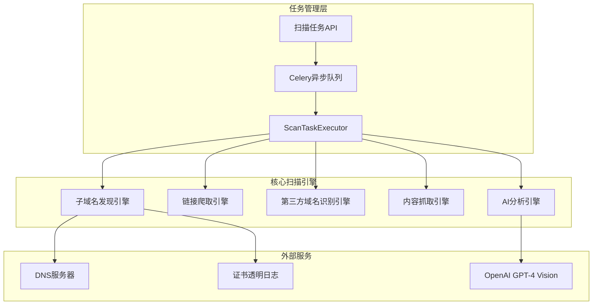

# AI内容安全监控系统 - 核心扫描引擎逻辑文档

## 📋 文档概述

本文档详细描述了AI内容安全监控系统的核心扫描引擎架构、各子引擎的实现逻辑、工作流程以及技术细节。

## 🏗️ 总体架构

### 系统架构图



### 核心组件

| 组件 | 文件路径 | 职责 |
|------|----------|------|
| 扫描任务执行器 | `app/engines/scan_executor.py` | 统筹整个扫描流程 |
| 子域名发现引擎 | `app/engines/subdomain_discovery.py` | 发现目标域名的子域名 |
| 链接爬取引擎 | `app/engines/link_crawler.py` | 爬取网页链接和资源 |
| 第三方域名识别引擎 | `app/engines/third_party_identifier.py` | 识别和分类第三方域名 |
| 内容抓取引擎 | `app/engines/content_capture.py` | 抓取页面内容和截图 |
| AI分析引擎 | `app/engines/ai_analysis.py` | AI驱动的内容安全分析 |

## 🔄 扫描流程概述

### 1. 扫描阶段划分

```python
# 阶段1: 子域名发现 (0-20%)
await self._execute_subdomain_discovery(result, config)

# 阶段2: 改进的链接爬取 (20-50%)  
await self._execute_improved_link_crawling(result, config)

# 阶段3: 第三方域名识别 (50-70%)
await self._execute_third_party_identification(result, config)

# 阶段4: 内容抓取 (70-85%)
await self._execute_content_capture(result, config)

# 阶段5: AI分析 (85-100%)
await self._execute_ai_analysis(result, config)
```

### 2. 扫描执行结果结构

```python
class ScanExecutionResult:
    # 基本信息
    task_id: str
    target_domain: str  
    status: str         # pending, running, completed, failed, cancelled
    progress: int       # 0-100
    
    # 扫描结果
    subdomains: List[SubdomainResult]                    # 子域名列表
    crawl_results: List[CrawlResult]                     # 爬取结果
    third_party_domains: List[ThirdPartyDomainResult]    # 第三方域名
    content_results: List[ContentResult]                 # 内容抓取结果
    violation_records: List[ViolationRecord]             # 违规记录
    
    # 统计信息
    statistics: Dict[str, Any] = {
        'total_subdomains': 0,              # 总子域名数
        'accessible_subdomains': 0,         # 可访问子域名数
        'total_pages_crawled': 0,           # 总爬取页面数
        'total_links_found': 0,             # 总链接数
        'total_resources_found': 0,         # 总资源数
        'total_third_party_domains': 0,     # 第三方域名数
        'high_risk_domains': 0,             # 高风险域名数
        'total_screenshots': 0,             # 截图数量
        'total_violations': 0,              # 总违规数
        'ai_analysis_completed': 0,         # AI分析完成数
        'execution_duration': 0,            # 执行时长(秒)
        'crawl_success_rate': 0,            # 爬取成功率
        'type_distribution': {}             # 域名类型分布
    }
```

## 🔍 子域名发现引擎

### 发现方法

#### 1. DNS查询方法
- **原理**: 通过DNS解析常见子域名模式
- **字典**: 包含200+常见子域名（www, api, admin等）
- **技术**: 异步DNS查询，5秒超时
- **特点**: 并发查询，自动异常处理

```python
common_subdomains = [
    'www', 'mail', 'ftp', 'admin', 'api', 'dev', 'test', 'staging',
    'cms', 'blog', 'shop', 'support', 'docs', 'cdn', 'assets'
]
```

#### 2. 证书透明日志方法
- **数据源**: crt.sh, Certspotter API
- **原理**: 查询SSL证书中的子域名信息
- **验证**: 过滤通配符，验证域名格式
- **优势**: 发现隐藏的子域名

```python
async def _query_crt_sh(self, domain: str):
    url = f"https://crt.sh/?q=%25.{domain}&output=json"
    # 解析证书数据，提取子域名
```

#### 3. 字典爆破方法
- **策略**: 使用预定义字典暴力枚举
- **优化**: 并发查询，智能重试
- **扩展**: 支持自定义字典

### 可访问性检测

```python
async def check_accessibility(self, subdomain: str) -> SubdomainResult:
    """检测子域名可访问性"""
    for scheme in ['https', 'http']:
        try:
            async with aiohttp.ClientSession() as session:
                response = await session.get(f"{scheme}://{subdomain}")
                if response.status < 400:
                    return SubdomainResult(subdomain, accessible=True)
        except:
            continue
```

## 🕷️ 链接爬取引擎

### 改进的迭代爬取算法

```python
async def _execute_improved_link_crawling(self, result, config):
    max_iterations = config.get('max_crawl_iterations', 10)
    current_iteration = 0
    urls_to_crawl = set(initial_urls)
    
    while current_iteration < max_iterations and urls_to_crawl:
        # 当前轮次爬取
        crawl_results = await self.crawler_engine.crawl_domain(
            result.target_domain, list(urls_to_crawl), config
        )
        
        # 从爬取结果中发现新子域名
        new_subdomains = self._extract_subdomains_from_links(all_found_links)
        
        # 添加新子域名到爬取队列
        for subdomain in new_subdomains:
            urls_to_crawl.add(f"https://{subdomain}")
        
        current_iteration += 1
```

### 链接提取器

**支持的链接类型**:
- HTML链接: `<a href>`, `<link href>`
- 资源链接: ``, `<script src>`
- 表单链接: `<form action>`
- CSS链接: `url()`, `@import`

```python
def extract_links_from_html(self, html: str, base_url: str):
    soup = BeautifulSoup(html, 'html.parser')
    
    links = []
    resources = []
    forms = []
    
    # 提取各类链接
    for tag in soup.find_all(['a', 'link']):
        href = tag.get('href')
        if href:
            absolute_url = urljoin(base_url, href)
            links.append(absolute_url)
    
    return links, resources, forms
```

### Robots.txt 遵守

```python
class RobotsChecker:
    async def can_fetch(self, url: str, user_agent: str = '*') -> bool:
        robots_url = f"{parsed.netloc}/robots.txt"
        robots = await self._load_robots_txt(robots_url)
        return robots.can_fetch(user_agent, url) if robots else True
```

## 🏢 第三方域名识别引擎

### 域名分类系统

内置全面的域名分类模式库：

```python
domain_patterns = {
    'cdn': {
        'patterns': [r'.*\.cloudfront\.net', r'.*\.fastly\.com'],
        'risk_level': 'low'
    },
    'analytics': {
        'patterns': [r'.*\.google-analytics\.com', r'.*\.mixpanel\.com'],
        'risk_level': 'medium'
    },
    'advertising': {
        'patterns': [r'.*\.googlesyndication\.com', r'.*\.doubleclick\.net'],
        'risk_level': 'medium'
    },
    'payment': {
        'patterns': [r'.*\.paypal\.com', r'.*\.stripe\.com'],
        'risk_level': 'high'
    }
}
```

### 风险评估算法

```python
def analyze_domain_risk(self, domain: str) -> str:
    risk_score = 0.0
    
    # 1. 基于模式的基础风险
    risk_score += self._get_base_risk_by_pattern(domain)
    
    # 2. TLD风险评估
    risk_score += self._analyze_tld_risk(domain)
    
    # 3. 可疑关键词检测
    risk_score += self._analyze_suspicious_keywords(domain)
    
    # 风险等级映射
    if risk_score >= 0.8: return 'critical'
    elif risk_score >= 0.6: return 'high'
    elif risk_score >= 0.4: return 'medium'
    else: return 'low'
```

### 可疑域名检测

```python
high_risk_keywords = [
    'malware', 'virus', 'phishing', 'spam', 'scam', 'fraud',
    'adult', 'porn', 'gambling', 'casino', 'hack', 'crack'
]

suspicious_patterns = [
    r'[0-9]{4,}',          # 大量数字
    r'[a-z]-[a-z]-[a-z]',  # 短横线分隔
    r'^[a-z]{20,}',        # 超长域名
]
```

## 📸 内容抓取引擎

### 截图服务 (Playwright)

```python
class ScreenshotService:
    async def capture_screenshot(self, url: str) -> Tuple[str, str]:
        page = await self.context.new_page()
        
        try:
            # 访问页面
            response = await page.goto(url, wait_until='networkidle')
            
            # 等待页面加载
            await page.wait_for_load_state('networkidle')
            await asyncio.sleep(2)
            
            # 获取内容和截图
            html_content = await page.content()
            await page.screenshot(path=screenshot_path, full_page=True)
            
            return screenshot_path, html_content
            
        except Exception as e:
            return await self._create_error_screenshot(url, str(e)), ""
        finally:
            await page.close()
```

### 浏览器配置

```python
browser = await playwright.chromium.launch(
    headless=True,
    args=[
        '--no-sandbox',
        '--disable-setuid-sandbox', 
        '--disable-dev-shm-usage',
        '--disable-gpu',
        '--window-size=1920,1080'
    ]
)

context = await browser.new_context(
    viewport={'width': 1920, 'height': 1080},
    user_agent='Mozilla/5.0 (Windows NT 10.0; Win64; x64) ...'
)
```

## 🤖 AI分析引擎

### OpenAI客户端

```python
class OpenAIClient:
    async def analyze_content(self, prompt: str, image_data: str) -> Dict:
        headers = {"Authorization": f"Bearer {api_key}"}
        
        request_data = {
            "model": self.ai_config.ai_model_name,
            "messages": [
                {"role": "system", "content": self._get_system_prompt()},
                {
                    "role": "user", 
                    "content": [
                        {"type": "text", "text": prompt},
                        {
                            "type": "image_url",
                            "image_url": {
                                "url": f"data:image/png;base64,{image_data}"
                            }
                        }
                    ]
                }
            ]
        }
        
        # 发送请求到OpenAI API
        async with self.session.post(api_url, headers=headers, json=request_data) as response:
            return await response.json()
```

### 系统提示词

```python
def _get_system_prompt(self) -> str:
    return """你是一个专业的内容安全分析专家。请分析提供的网页内容和截图，识别是否存在以下违规情况：

1. 色情内容 (NSFW)
2. 暴力内容
3. 赌博相关
4. 诈骗信息
5. 恶意软件
6. 仇恨言论
7. 侵权内容
8. 其他违法违规内容

请按照JSON格式返回分析结果：
{
  "has_violation": boolean,
  "violation_types": ["类型1", "类型2"],
  "confidence_score": 0.0-1.0,
  "risk_level": "low|medium|high|critical",
  "description": "详细描述"
}"""
```

### 分析流程

```python
async def analyze_domains(self, domains_to_analyze):
    violations = []
    
    for domain in domains_to_analyze:
        if not domain.screenshot_path or not Path(domain.screenshot_path).exists():
            continue
            
        # 读取截图
        async with aiofiles.open(domain.screenshot_path, 'rb') as f:
            screenshot_data = await f.read()
            image_base64 = base64.b64encode(screenshot_data).decode('utf-8')
        
        # 构建分析提示
        prompt = f"请分析域名 {domain.domain} 的页面内容是否存在违规情况。"
        
        # 调用AI分析
        try:
            ai_result = await self.openai_client.analyze_content(prompt, image_base64)
            
            # 解析AI响应
            analysis_result = self._parse_ai_response(ai_result)
            
            if analysis_result.has_violation:
                violation = ViolationRecord(
                    domain=domain.domain,
                    violation_types=analysis_result.violation_types,
                    risk_level=analysis_result.risk_level,
                    confidence_score=analysis_result.confidence_score,
                    description=analysis_result.description
                )
                violations.append(violation)
                
        except Exception as e:
            self.logger.error(f"AI分析失败: {domain.domain}, {e}")
    
    return violations
```

## 📊 任务管理和监控

### 实时进度跟踪

系统通过多层机制实现精确的进度跟踪：

```python
def _get_current_stage(self, progress: int) -> str:
    """根据进度获取当前阶段"""
    if progress <= 25:
        return "子域名发现"
    elif progress <= 50:
        return "链接爬取"
    elif progress <= 70:
        return "第三方域名识别"
    elif progress <= 85:
        return "内容抓取"
    elif progress <= 100:
        return "AI分析"
    else:
        return "完成"
```

### 立即数据保存机制

为了提高数据可靠性，系统在每个阶段完成后立即保存结果：

```python
async def _save_subdomain_results(self, result: ScanExecutionResult):
    """立即保存子域名结果到数据库"""
    try:
        async with AsyncSessionLocal() as db:
            saved_count = 0
            for subdomain in result.subdomains:
                record = SubdomainRecord(
                    task_id=result.task_id,
                    subdomain=subdomain.subdomain,
                    is_accessible=subdomain.is_accessible,
                    ip_address=subdomain.ip_address
                )
                db.add(record)
                saved_count += 1
            
            await db.commit()
            self.logger.info(f"已保存 {saved_count} 条子域名记录")
    except Exception as e:
        self.logger.error(f"保存子域名结果失败: {e}")
```

### Celery任务调度

```python
@celery_app.task(bind=True, name="scan_domain_task")
def scan_domain_task(self, task_id: str, user_id: str, target_domain: str, config: Dict):
    """域名扫描后台任务"""
    loop = asyncio.new_event_loop()
    asyncio.set_event_loop(loop)
    
    try:
        # 检查任务存在性
        task_exists = loop.run_until_complete(_check_task_exists(task_id))
        if not task_exists:
            raise Exception(f"任务 {task_id} 在数据库中不存在")
        
        # 执行扫描
        result = loop.run_until_complete(
            _execute_scan_task(task_id, user_id, target_domain, config)
        )
        return result
    finally:
        loop.close()
```

### WebSocket实时通信

系统集成了完善的WebSocket心跳机制和实时通信：

```python
async def _update_progress(self, result, progress: int, message: str):
    """更新进度并发送WebSocket通知"""
    result.progress = progress
    self.logger.info(f"进度更新: {progress}% - {message}")
    
    # 发送WebSocket通知
    try:
        stage = self._get_current_stage(progress)
        await task_monitor.notify_task_progress(
            self.task_id, progress, stage, message
        )
    except Exception as e:
        self.logger.warning(f"发送进度通知失败: {e}")
    
    # 执行进度回调
    if self.progress_callback:
        try:
            await self.progress_callback(self.task_id, progress, message)
        except Exception as e:
            self.logger.warning(f"进度回调失败: {e}")
```

#### WebSocket管理器配置

```python
class WebSocketManager:
    def __init__(self):
        # 心跳配置
        self.heartbeat_interval = 30  # 心跳间隔（30秒）
        self.heartbeat_timeout = 90   # 心跳超时（90秒）
        self.ping_interval = 25       # 主动ping间隔（25秒）
        self.max_missed_pings = 3     # 最大未响应ping数
        
        # 统计信息
        self.heartbeat_stats = {
            'total_pings_sent': 0,
            'total_pongs_received': 0,
            'timeout_disconnections': 0,
            'last_cleanup_time': time.time()
        }
```

### 数据库存储

```python
async def _save_scan_results(db, scan_result: ScanExecutionResult):
    """保存扫描结果到数据库"""
    
    # 保存子域名记录
    for subdomain in scan_result.subdomains:
        record = SubdomainRecord(
            task_id=scan_result.task_id,
            subdomain=subdomain.subdomain,
            is_accessible=subdomain.is_accessible,
            ip_address=subdomain.ip_address
        )
        db.add(record)
    
    # 保存第三方域名记录
    for third_party in scan_result.third_party_domains:
        record = ThirdPartyDomain(
            task_id=scan_result.task_id,
            domain=third_party.domain,
            domain_type=third_party.domain_type,
            risk_level=third_party.risk_level
        )
        db.add(record)
    
    # 保存违规记录
    for violation in scan_result.violation_records:
        record = ViolationRecord(
            task_id=scan_result.task_id,
            domain=violation.domain,
            violation_type=violation.violation_type,
            risk_level=violation.risk_level,
            confidence_score=violation.confidence_score
        )
        db.add(record)
    
    await db.commit()
```

## 🛠️ 配置和优化

### 扫描配置参数

系统支持灵活的配置选项，可根据不同需求调整扫描策略：

```python
default_config = {
    # 子域名发现
    'subdomain_discovery_enabled': True,
    'max_subdomains': 500,
    'subdomain_discovery_timeout': 300,
    
    # 链接爬取
    'link_crawling_enabled': True,
    'max_crawl_iterations': 10,
    'max_pages_per_domain': 100,
    'respect_robots_txt': True,
    'crawl_delay': 1.0,
    'max_concurrent_requests': 10,
    
    # 第三方域名识别
    'third_party_identification_enabled': True,
    'risk_threshold': 'medium',
    'domain_analysis_enabled': True,
    
    # 内容抓取
    'content_capture_enabled': True,
    'screenshot_timeout': 30,
    'full_page_screenshot': True,
    'capture_mobile_view': False,
    'viewport_width': 1920,
    'viewport_height': 1080,
    
    # AI分析
    'ai_analysis_enabled': True,
    'ai_model': 'gpt-4-vision-preview',
    'analysis_prompt_template': 'default',
    'max_tokens': 4000,
    'temperature': 0.1,
    'retry_count': 3,
    'request_timeout': 30
}
```

### 高级配置选项

```python
# 性能优化配置
performance_config = {
    'enable_caching': True,
    'cache_ttl': 3600,
    'max_memory_usage': '2GB',
    'enable_compression': True,
    'parallel_processing': True
}

# 安全配置
security_config = {
    'enable_ssl_verification': True,
    'user_agent_rotation': True,
    'proxy_enabled': False,
    'rate_limiting': True,
    'max_requests_per_minute': 60
}
```

### 性能优化

1. **并发控制**: 使用异步编程和连接池
2. **缓存机制**: robots.txt缓存，DNS缓存
3. **资源限制**: 页面大小限制，超时控制
4. **错误处理**: 重试机制，优雅降级
5. **内存管理**: 及时释放浏览器资源

### 错误处理和重试

```python
async def execute_with_retry(self, func, max_retries=3):
    """带重试的执行函数"""
    for attempt in range(max_retries):
        try:
            return await func()
        except Exception as e:
            if attempt == max_retries - 1:
                raise e
            await asyncio.sleep(2 ** attempt)  # 指数退避
```

## 📈 监控和统计

### 扫描统计信息

系统自动收集和计算各种统计指标：

#### 基础统计
- 子域名发现数量和可访问性
- 页面爬取成功率和响应时间  
- 第三方域名分布和风险等级
- AI分析准确率和处理时间
- 整体扫描时间和资源消耗

#### 详细统计计算

```python
async def _calculate_final_statistics(self, result: ScanExecutionResult):
    """计算最终统计信息"""
    try:
        # 计算风险域名分布
        risk_distribution = {'low': 0, 'medium': 0, 'high': 0, 'critical': 0}
        for domain in result.third_party_domains:
            risk_level = domain.risk_level.lower()
            if risk_level in risk_distribution:
                risk_distribution[risk_level] += 1
        
        result.statistics['risk_distribution'] = risk_distribution
        result.statistics['high_risk_domains'] = (
            risk_distribution['high'] + risk_distribution['critical']
        )
        
        # 计算域名类型分布
        type_distribution = {}
        for domain in result.third_party_domains:
            domain_type = domain.domain_type
            type_distribution[domain_type] = type_distribution.get(domain_type, 0) + 1
        
        result.statistics['type_distribution'] = type_distribution
        
        # 计算成功率
        if result.statistics['total_pages_crawled'] > 0:
            result.statistics['crawl_success_rate'] = int(
                result.statistics['total_pages_crawled'] / 
                (result.statistics['total_pages_crawled'] + len(result.errors)) * 100
            )
        
        self.logger.info("最终统计信息计算完成")
        
    except Exception as e:
        self.logger.warning(f"统计信息计算失败: {e}")
```

### 实时监控

通过WebSocket实现实时监控：
- 扫描进度更新
- 阶段切换通知
- 错误和警告信息
- 违规发现实时推送

## 🔧 错误处理和恢复机制

### 分阶段错误处理

系统在每个扫描阶段都实现了完善的错误处理机制：

```python
async def _execute_subdomain_discovery(self, result: ScanExecutionResult, config: Dict[str, Any]):
    """执行子域名发现"""
    try:
        self.logger.info("开始子域名发现阶段")
        
        subdomains = await self.subdomain_engine.discover_all(result.target_domain, config)
        result.subdomains = subdomains
        
        # 更新统计
        result.statistics['total_subdomains'] = len(subdomains)
        result.statistics['accessible_subdomains'] = sum(1 for s in subdomains if s.is_accessible)
        
        # 立即保存子域名记录到数据库
        if subdomains:
            await self._save_subdomain_results(result)
        
    except Exception as e:
        error_msg = f"子域名发现失败: {str(e)}"
        result.errors.append(error_msg)
        result.warnings.append("将继续执行后续阶段")
        self.logger.error(error_msg)
        # 不抛出异常，继续执行后续阶段
```

### 任务取消机制

```python
async def cancel_scan(self):
    """取消扫描"""
    self.is_cancelled = True
    self.logger.info("收到取消扫描请求")
    
    # 通知所有子引擎停止工作
    if self.ai_engine:
        await self.ai_engine.cancel_analysis()
    
    await self.capture_engine.cancel_capture()
```

### 资源清理

```python
async def cleanup_resources(self):
    """清理扫描过程中使用的资源"""
    try:
        # 清理临时文件
        await self.capture_engine.cleanup_screenshots()
        
        # 关闭网络连接
        if self.ai_engine:
            await self.ai_engine.close_connections()
        
        # 清理缓存
        await self.crawler_engine.clear_cache()
        
        self.logger.info("资源清理完成")
    except Exception as e:
        self.logger.warning(f"资源清理失败: {e}")
```

## 📚 扩展和定制

### 自定义分析引擎

系统支持插件化的分析引擎扩展：

```python
class CustomAnalysisEngine:
    """自定义分析引擎接口"""
    
    async def analyze_content(self, content_result: ContentResult) -> List[ViolationRecord]:
        """自定义内容分析逻辑"""
        pass
    
    async def get_analysis_config(self) -> Dict[str, Any]:
        """获取分析配置"""
        pass
```

### 自定义域名识别规则

```python
custom_domain_patterns = {
    'social_media': {
        'patterns': [r'.*\.facebook\.com', r'.*\.twitter\.com'],
        'risk_level': 'low',
        'description': '社交媒体平台'
    },
    'custom_category': {
        'patterns': [r'.*\.example\.com'],
        'risk_level': 'high',
        'description': '自定义高风险域名'
    }
}
```

## 📖 总结

这份文档详细描述了AI内容安全监控系统核心扫描引擎的：

- **完整架构设计**: 5层扫描引擎的协调工作机制
- **实现逻辑**: 每个子引擎的具体实现细节和优化策略
- **技术细节**: WebSocket实时通信、Celery任务调度、数据库存储等
- **监控机制**: 详细的统计信息收集和实时进度跟踪
- **错误处理**: 完善的异常处理和资源清理机制
- **扩展能力**: 插件化设计支持自定义功能扩展

该系统通过模块化设计、异步处理、智能重试、实时监控等技术手段，实现了高效、稳定、可扩展的内容安全扫描能力，为企业级应用提供了可靠的技术保障。

---

*文档版本: v2.1*  
*最后更新: 2024年12月*  
*维护者: AI内容安全监控系统开发团队*