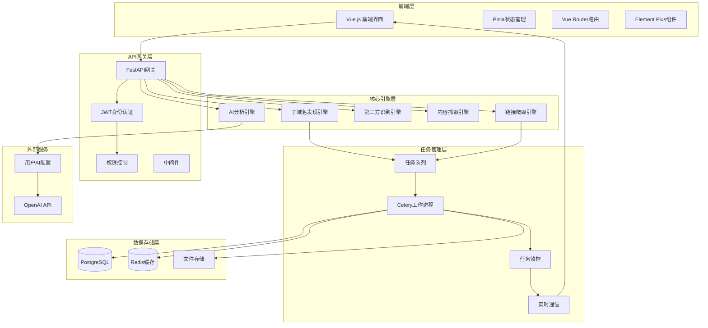
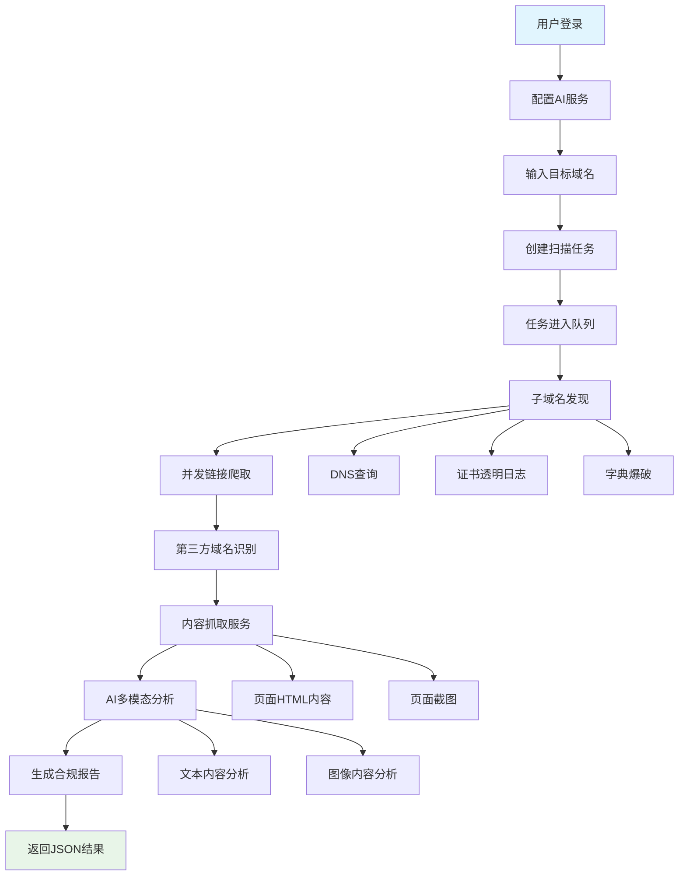
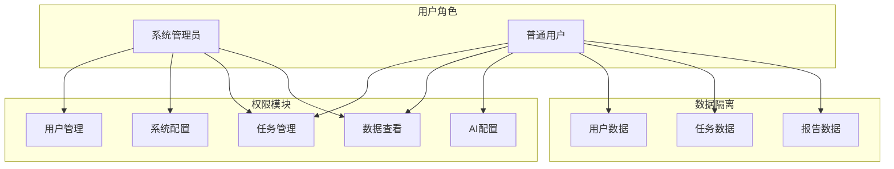

# 域名合规扫描系统架构设计

## 系统概述

域名合规扫描系统是一个基于 Vue.js + FastAPI 的智能合规检测平台，能够自动化识别和评估第三方域名的内容安全风险。

### 技术栈规划

**前端**: Vue.js 3.x + TypeScript + Element Plus + Pinia + Vue Router + Vite
**后端**: FastAPI + SQLAlchemy + Celery + Redis + PostgreSQL + Playwright  
**AI服务**: 用户自定义 OpenAI API + 多AI提供商支持
**认证授权**: JWT Token + 基于角色的访问控制(RBAC)
**数据隔离**: 基于用户的多租户数据隔离

## 系统架构图

## 核心业务流程

## 用户权限体系

## 模块功能详细说明

### 1. 用户认证与权限模块
- JWT Token认证
- 基于角色的权限控制(RBAC)
- 用户数据隔离
- 个人AI配置管理

### 2. 子域名发现引擎
- DNS查询（A、AAAA、CNAME记录）
- 证书透明日志查询
- 子域名字典爆破
- 并发控制和去重

### 3. 链接爬取引擎
- 递归爬取页面链接
- 深度控制和超时设置
- robots.txt遵循
- 请求频率控制

### 4. 第三方域名识别引擎
- 静态资源域名识别
- API接口域名提取
- 社交媒体插件识别
- 广告和追踪域名检测

### 5. 内容抓取引擎
- Playwright页面截图
- HTML内容提取
- 文件下载和存储
- 异常处理和重试

### 6. AI分析引擎
- 多模态内容分析
- 用户自定义AI配置
- 风险等级评估
- 违规类型分类

### 7. 任务监控系统
- 实时进度跟踪
- WebSocket状态推送
- 详细日志记录
- 错误处理和恢复

### 8. 报告生成系统
- 标准化JSON格式
- 风险统计分析
- 可视化图表数据
- 导出功能支持

## 系统配置管理

### 扫描任务配置
- 最大并发任务数
- 子域名发现上限
- 爬取深度限制
- 超时时间设置

### AI分析配置
- OpenAI API配置
- 模型选择和参数
- 提示词模板
- 置信度阈值

### 安全配置
- 请求频率限制
- IP白名单设置
- 数据加密配置
- 访问日志记录

## 数据模型设计

### 核心表结构
1. **users** - 用户信息表
2. **user_ai_configs** - 用户AI配置表
3. **scan_tasks** - 扫描任务表
4. **task_logs** - 任务日志表
5. **subdomains** - 子域名表
6. **third_party_domains** - 第三方域名表
7. **violation_records** - 违规记录表
8. **system_configs** - 系统配置表
9. **user_permissions** - 用户权限表

## API接口设计

### 认证相关
- POST /api/v1/auth/login - 用户登录
- POST /api/v1/auth/logout - 用户登出
- POST /api/v1/auth/refresh - 刷新Token

### 任务管理
- POST /api/v1/tasks - 创建扫描任务
- GET /api/v1/tasks - 获取任务列表
- GET /api/v1/tasks/{id} - 获取任务详情
- GET /api/v1/tasks/{id}/logs - 获取任务日志
- DELETE /api/v1/tasks/{id} - 删除任务

### 配置管理
- GET /api/v1/config/ai - 获取AI配置
- PUT /api/v1/config/ai - 更新AI配置
- GET /api/v1/config/system - 获取系统配置
- PUT /api/v1/config/system - 更新系统配置

### 报告相关
- GET /api/v1/reports/{task_id} - 获取任务报告
- GET /api/v1/reports/{task_id}/export - 导出报告

## 部署架构

### 开发环境
- 前端: Vite Dev Server (localhost:5173)
- 后端: FastAPI Dev Server (localhost:8000)
- 数据库: PostgreSQL (localhost:5432)
- 缓存: Redis (localhost:6379)
- 队列: Celery Worker

### 生产环境
- 前端: Nginx静态文件服务
- 后端: Gunicorn + FastAPI
- 数据库: PostgreSQL集群
- 缓存: Redis Cluster
- 队列: Celery + Redis Sentinel
- 监控: Prometheus + Grafana

## 技术实现要点

### 1. 数据隔离
每个用户只能访问自己创建的任务和数据，通过数据库层面的user_id过滤实现。

### 2. 异步任务处理
使用Celery处理耗时的扫描任务，避免API请求超时。

### 3. 实时状态更新
通过WebSocket推送任务状态，让用户实时了解扫描进度。

### 4. 用户自定义AI
支持用户配置自己的OpenAI API密钥和参数，提供灵活的AI分析能力。

### 5. 安全防护
- API限流
- 输入验证
- SQL注入防护
- XSS防护
- CSRF保护

### 6. 可扩展设计
- 模块化架构
- 插件式AI提供商
- 可配置的扫描引擎
- 标准化的报告格式